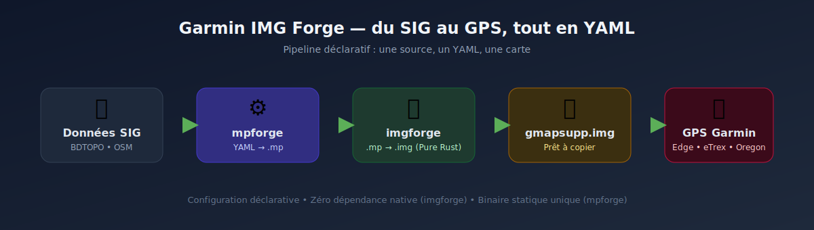
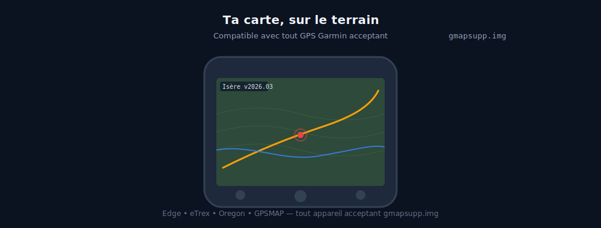

<h1 align="center">
  <br>
  Garmin IMG Forge
  <br>
</h1>

<h4 align="center">Du SIG au GPS en une ligne de commande.<br/>Des cartes Garmin <code>.img</code> de qualité professionnelle, pilotées par de simples fichiers <strong>YAML</strong>.</h4>

<p align="center">
  <a href="https://imgforge.garmin.allfabox.fr/" target="_blank"></a>
  <a href="https://www.rust-lang.org/" target="_blank"></a>
  <a href="https://gdal.org/" target="_blank"></a>
  <a href="https://woodpecker-ci.org/" target="_blank"></a>
  <a href="./LICENSE" target="_blank"></a>
</p>

<p align="center">
  <a href="#pourquoi-garmin-img-forge-">Pourquoi</a> •
  <a href="#-démarrage-rapide--première-carte-en-5-minutes">Démarrage rapide</a> •
  <a href="#-mise-en-place-dun-pipeline-de-production">Pipeline de production</a> •
  <a href="#galerie">Galerie</a> •
  <a href="#-ressources">Ressources</a>
</p>

<p align="center">
  
</p>

> **Miroir public en lecture.** Ce dépôt GitHub est un clone miroir filtré d'un dépôt Forgejo interne. Les issues et pull requests GitHub sont bienvenues, mais mergées côté source (voir [CONTRIBUTING.md](./CONTRIBUTING.md)).

---

## Pourquoi Garmin IMG Forge ?

Vous disposez de données SIG vectorielles — BDTOPO, OpenStreetMap, shapefiles métier, couches cadastrales — et souhaitez les exploiter sur un GPS Garmin (Edge, eTrex, Oregon, GPSMAP) sans recourir à une chaîne d'outils propriétaires ni à des manipulations manuelles.

**Garmin IMG Forge** est une suite open source qui transforme vos sources SIG en cartes Garmin prêtes à déployer, au moyen de fichiers YAML déclaratifs.

| Atout                     | Description |
|---------------------------|-------------|
| **Approche déclarative**  | Un fichier YAML décrit la carte cible ; la chaîne se charge du reste. Versionnable, diffable, rejouable à l'identique. |
| **Déploiement simplifié** | `mpforge` embarque GDAL, PROJ et GEOS en liaison statique. `imgforge` est écrit en Rust pur. Un binaire unique, aucune dépendance système à l'exécution. |
| **Multi-zoom natif**      | Profils de simplification conditionnels par attribut (`CL_ADMIN`, `IMPORTANCE`…) — jusqu'à **10 géométries par feature** selon le niveau de zoom. Fonctionnalité absente de `mkgmap`. |
| **Prêt pour la production** | Pipeline CI/CD complet, releases reproductibles, métadonnées et checksums SHA-256 signés. |
| **Logiciel libre**        | Licences GPL v3 / MIT. Vos données, vos règles, votre infrastructure. |

### Les briques

| Outil                                             | Rôle                                                   | Langage         | Licence |
|---------------------------------------------------|--------------------------------------------------------|-----------------|---------|
| [`ogr-polishmap`](./tools/ogr-polishmap/)         | Driver GDAL/OGR pour le format Polish Map (`.mp`)      | C++             | MIT     |
| [`mpforge`](./tools/mpforge/)                     | SIG → tuiles `.mp` (règles YAML, multi-zoom)           | Rust + GDAL     | GPL v3  |
| [`imgforge`](./tools/imgforge/)                   | `.mp` → Garmin `.img` (remplace `cGPSmapper`)          | Rust pur        | GPL v3  |
| [`ogr-garminimg`](./tools/ogr-garminimg/) *(WIP)* | Driver GDAL/OGR de lecture pour les `.img` (diagnostic) | C++            | —       |

---

## 🚀 Démarrage rapide — première carte en 5 minutes

> **Objectif :** produire un `gmapsupp.img` à partir d'un exemple YAML fourni, puis le déployer sur un GPS Garmin.

### 1. Récupérer les binaires *(ou compiler depuis les sources — voir [pré-requis](#pré-requis-détaillés))*

```bash
# Binaires statiques Linux x64 publiés à chaque release
curl -LO https://github.com/allfab/garmin-img-forge/releases/latest/download/mpforge
curl -LO https://github.com/allfab/garmin-img-forge/releases/latest/download/imgforge
chmod +x mpforge imgforge
```

### 2. Sélectionner un exemple YAML livré avec le dépôt

```bash
git clone https://github.com/allfab/garmin-img-forge.git
cd garmin-img-forge/tools/mpforge/examples
ls *.yaml
# simple.yaml • simple-with-mapping.yaml • bdtopo.yaml • france-nord-bdtopo.yaml ...
```

### 3. Générer les tuiles `.mp`

```bash
mpforge --config simple.yaml --output /tmp/tuiles/
```

### 4. Compiler en `.img` pour le GPS

```bash
imgforge /tmp/tuiles/*.mp --output gmapsupp.img
```

### 5. Déployer sur le GPS

Connectez le GPS en USB, copiez `gmapsupp.img` dans le dossier `Garmin/` de la carte SD (ou de la mémoire interne), puis déconnectez. La carte est immédiatement disponible dans le gestionnaire de cartes Garmin.

<p align="center">
  
</p>

---

## 🏭 Mise en place d'un pipeline de production

Pour passer d'un exemple de démonstration à une production régulière de cartes régionales ou thématiques, le dépôt fournit un **squelette de pipeline** prêt à personnaliser.

### Anatomie d'un pipeline

```
pipeline/
├── configs/           # Vos fichiers YAML (par région, par thématique)
│   ├── ign-bdtopo/    #   ├── generalize-profiles.yaml  (profils multi-zoom)
│   │   └── departement/  #   └── <dept>.yaml            (une carte = un YAML)
│   └── osm/
├── data/              # Sources SIG téléchargées (BDTOPO, extraits OSM…)
├── output/<année>/    # Tuiles .mp + gmapsupp.img versionnés
└── resources/         # Fichiers TYP, icônes, ressources partagées
```

### Mise en place en 4 étapes

**1. Déclarer la carte** — créer `pipeline/configs/ign-bdtopo/departement/mon-departement.yaml` :

```yaml
map:
  name: "Mon Département — Randonnée"
  id: 61050000                  # identifiant Garmin unique
  copyright: "© IGN BDTOPO 2026"

sources:
  - path: data/BDTOPO/TRONCON_DE_ROUTE.shp
  - path: data/BDTOPO/COURS_D_EAU.shp

mapping:
  - where: "CL_ADMIN = 'Autoroute'"
    polish_type: 0x01
    profile: route_major        # référence un profil de generalize-profiles.yaml
  - where: "NATURE = 'Rivière'"
    polish_type: 0x1F
    profile: hydro_main

output:
  tile_size: 0.5                # degrés
```

> Exemples complets et documentés : [`tools/mpforge/examples/bdtopo-d038-config.yaml`](./tools/mpforge/examples/bdtopo-d038-config.yaml)

**2. Exécuter le pipeline en local :**

```bash
mpforge --config pipeline/configs/ign-bdtopo/departement/mon-departement.yaml \
        --output pipeline/output/2026/v2026.04/

imgforge pipeline/output/2026/v2026.04/*.mp \
         --output pipeline/output/2026/v2026.04/gmapsupp.img
```

**3. Intégrer en CI** — le dépôt fournit des pipelines Woodpecker pour l'infrastructure interne ainsi que des workflows GitHub Actions pour le miroir public. Documentation complète dans **[CI-CD.md](./CI-CD.md)**.

**4. Publier** — les releases sont pilotées par tag (`mpforge-v*`, `imgforge-v*`) via `scripts/release-tool.sh`. Chaque release produit un binaire, un fichier `SHA256SUMS` et des métadonnées JSON, automatiquement republiés sur le miroir GitHub.

---

## Galerie

<p align="center">
  
</p>

---

## Pré-requis détaillés

Aucune dépendance n'est requise pour exécuter les binaires publiés. Les dépendances suivantes ne s'appliquent qu'à la compilation depuis les sources :

| Composant                                           | Requis pour                          |
|-----------------------------------------------------|--------------------------------------|
| **Rust** (via [rustup](https://rustup.rs/))         | `mpforge`, `imgforge`                |
| **GCC/Clang + CMake ≥ 3.20**                        | `ogr-polishmap` (driver C++)         |
| **GDAL ≥ 3.6** (3.10+ recommandé)                   | `ogr-polishmap`, développement `mpforge` |
| **Python 3.10+ + PyQGIS** *(optionnel)*             | Plugin QGIS                          |
| **Java 11+ + mkgmap** *(optionnel)*                 | Génération avancée / comparaison     |

<details>
<summary><strong>Installation des dépendances (Debian/Ubuntu) et variables d'environnement</strong></summary>

```bash
# Rust
curl --proto '=https' --tlsv1.2 -sSf https://sh.rustup.rs | sh && source $HOME/.cargo/env

# C++ / GDAL
sudo apt install build-essential cmake pkg-config libgdal-dev

# Optionnel : QGIS, mkgmap
sudo apt install qgis python3-qgis openjdk-11-jre
```

```bash
# ~/.bashrc ou ~/.zshrc
export GDAL_DATA=/usr/share/gdal
export GDAL_DRIVER_PATH=$HOME/.gdal/plugins
export GDAL_HOME=/usr
export RUST_BACKTRACE=1
export RUST_LOG=info
mkdir -p ~/.gdal/plugins
```

```bash
# Build
cd tools/ogr-polishmap && cmake -B build -DCMAKE_BUILD_TYPE=Debug && cmake --build build
cd tools/mpforge       && cargo build --release
cd tools/imgforge      && cargo build --release
```

</details>

---

## 🔗 Ressources

| Ressource                          | URL |
|------------------------------------|-----|
| Site et documentation complète     | [imgforge.garmin.allfabox.fr](https://imgforge.garmin.allfabox.fr) |
| Cartes Garmin téléchargeables      | [download-maps.garmin.allfabox.fr](https://download-maps.garmin.allfabox.fr/) |
| Releases (binaires)                | [github.com/allfab/garmin-img-forge/releases](https://github.com/allfab/garmin-img-forge/releases) |
| CI/CD, tags, procédures de release | [CI-CD.md](./CI-CD.md) |
| Contribuer                         | [CONTRIBUTING.md](./CONTRIBUTING.md) |

### Structure du dépôt

```
garmin-img-forge/
├── tools/          # Code source (ogr-polishmap, mpforge, imgforge, ogr-garminimg)
├── pipeline/       # Squelette de production (configs YAML, data, output)
├── scripts/        # Orchestration — voir scripts/README.md
├── site/           # Sources du site Zensical
├── docs/           # Documentation projet (specs, planning, images README)
├── .woodpecker/    # CI Woodpecker (interne, non miroiré sur GitHub)
└── .github/        # Workflows et templates GitHub (miroir public)
```

---

## Crédits

Ce projet s'appuie sur des technologies éprouvées de l'écosystème open source :

- **[GDAL](https://gdal.org/)** — bibliothèque de traitement géospatial
- **[cGPSmapper](https://www.cgpsmapper.com/)** — spécification historique du format Polish Map
- **[mkgmap](https://www.mkgmap.org.uk/)** — inspiration et référence pour la génération de cartes Garmin
- **[IGN](https://www.ign.fr/)** — BDTOPO sous licence ouverte
- **[OpenStreetMap](https://www.openstreetmap.org/)** — données cartographiques libres
- **[Rust](https://www.rust-lang.org/) · [Zensical](https://zensical.org/) · [Woodpecker](https://woodpecker-ci.org/)** — stack moderne, sobre et auto-hébergeable

---

## Licences

- `ogr-polishmap` : **MIT**
- `mpforge`, `imgforge` : **GPL v3**
- Documentation du site : **[CC BY-SA 4.0](https://creativecommons.org/licenses/by-sa/4.0/deed.fr)**

Voir [`LICENSE`](./LICENSE) pour le détail.
