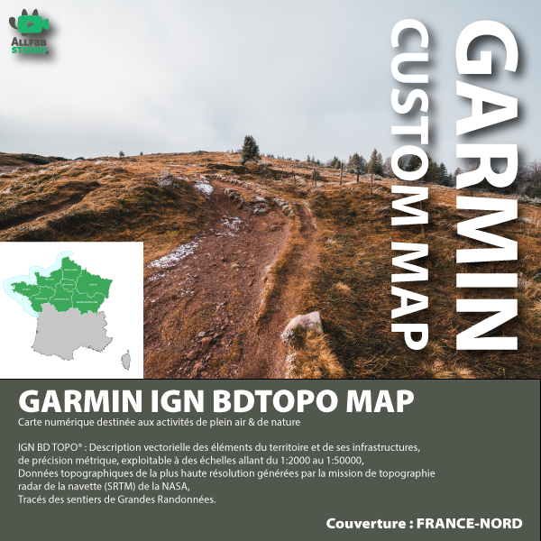
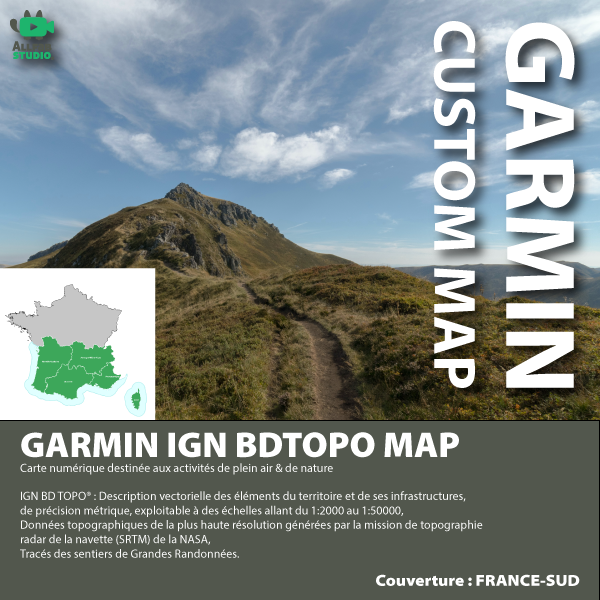

# :material-map: Metropolitan France

!!! tip "Choosing coverage"
    - **All of France (FXX)**: a single file for the entire metropolitan area — useful if
      you have a large capacity SD card.
    - **NORD / SUD halves**: two lighter files, convenient if your GPS
      limits the `gmapsupp.img` size.
    - **Garmin quadrants (NE / NO / SE / SO)**: mirroring the geographic division of the
      *Garmin TOPO France v7 PRO* maps, ideal for devices with limited memory.

## All of France

-   :material-earth:{ .lg .middle } Metropolitan France

    ---

    Covers all 96 metropolitan departments (Corsica included).
    Single file — check your GPS's available capacity.

    [:material-download: Download](files/national/fxx/latest/IGN-BDTOPO-FXX.img){ .md-button .md-button--primary }

## NORD / SUD halves

-   :fontawesome-regular-square-caret-up:{ .lg .middle } France NORD

    ---

    

    Covers the regions: Hauts-de-France, Grand Est, Normandie, Île-de-France,
    Bretagne, Pays de la Loire, Bourgogne-Franche-Comté, Centre-Val de Loire

    [:material-download: Download](files/national/france-nord/latest/IGN-BDTOPO-FRANCE-NORD.img){ .md-button .md-button--primary }

-   :fontawesome-regular-square-caret-down:{ .lg .middle } France SUD

    ---

    

    Covers the regions: Nouvelle-Aquitaine, Auvergne-Rhône-Alpes, Occitanie,
    Provence-Alpes-Côte d'Azur, Corse

    [:material-download: Download](files/national/france-sud/latest/IGN-BDTOPO-FRANCE-SUD.img){ .md-button .md-button--primary }

## Garmin Quadrants (TOPO France v7 PRO)

The quadrants exactly reproduce the geographic division of the official
*Garmin TOPO France v7 PRO* maps. Île-de-France is shared between
the North-East and North-West quadrants, following Garmin's choice.

-   :material-arrow-top-left:{ .lg .middle } France NORD-OUEST

    ---

    26 departments. Covered regions (partial): Bretagne, Pays de la Loire,
    Normandie (west), Centre-Val de Loire, Île-de-France (west).

    [:material-download: Download](files/quadrant/france-no/latest/IGN-BDTOPO-FRANCE-NO.img){ .md-button }

-   :material-arrow-top-right:{ .lg .middle } France NORD-EST

    ---

    33 departments. Covered regions (partial): Hauts-de-France, Grand Est,
    Bourgogne-Franche-Comté, Île-de-France (east), Normandie (east).

    [:material-download: Download](files/quadrant/france-ne/latest/IGN-BDTOPO-FRANCE-NE.img){ .md-button }

-   :material-arrow-bottom-left:{ .lg .middle } France SUD-OUEST

    ---

    20 departments. Covered regions (partial): Nouvelle-Aquitaine,
    Occitanie (west).

    [:material-download: Download](files/quadrant/france-so/latest/IGN-BDTOPO-FRANCE-SO.img){ .md-button }

-   :material-arrow-bottom-right:{ .lg .middle } France SUD-EST

    ---

    25 departments. Covered regions (partial): Auvergne-Rhône-Alpes,
    Provence-Alpes-Côte d'Azur, Occitanie (east), Corse.

    [:material-download: Download](https://download-maps.garmin.allfabox.fr/quadrant/france-se/v2026.03/IGN-BDTOPO-FRANCE-SE-v2026.03.img){ .md-button }

!!! tip "Tip"
    If you use the GPS mainly in one region, prefer the download
    [by region](regions.md) or [by department](department.md) — lighter
    file, faster loading.
