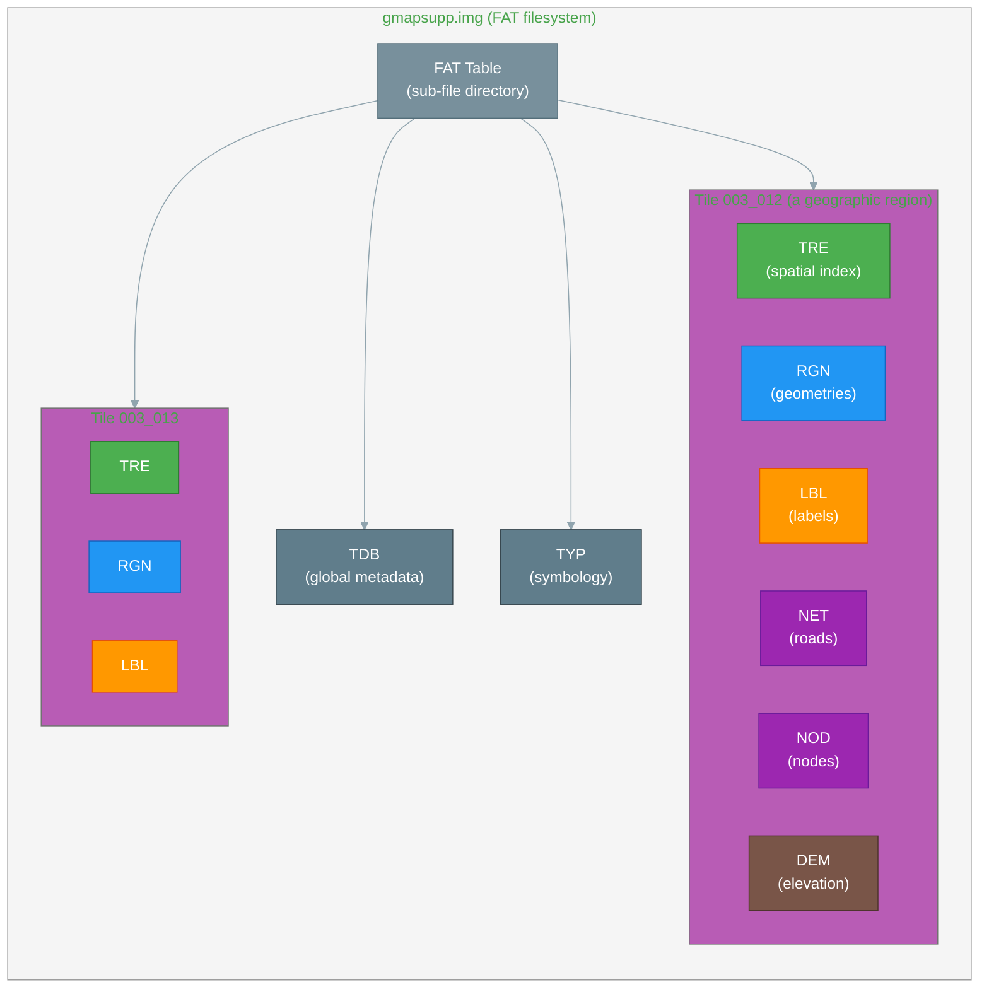
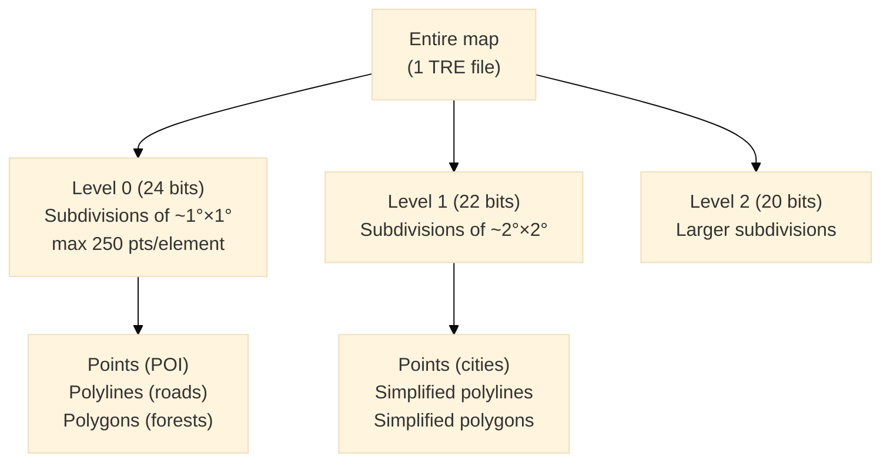
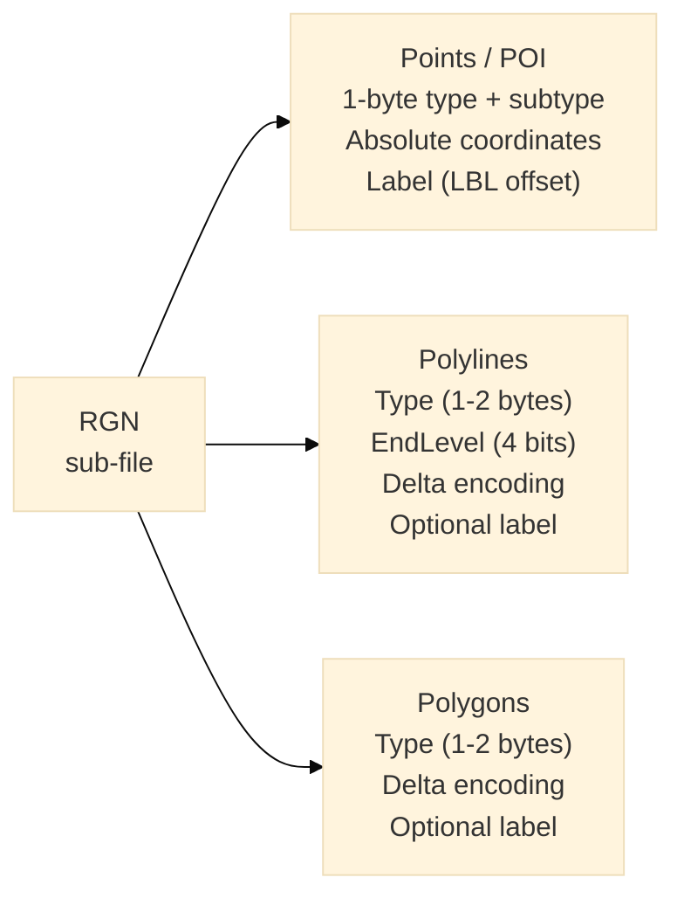
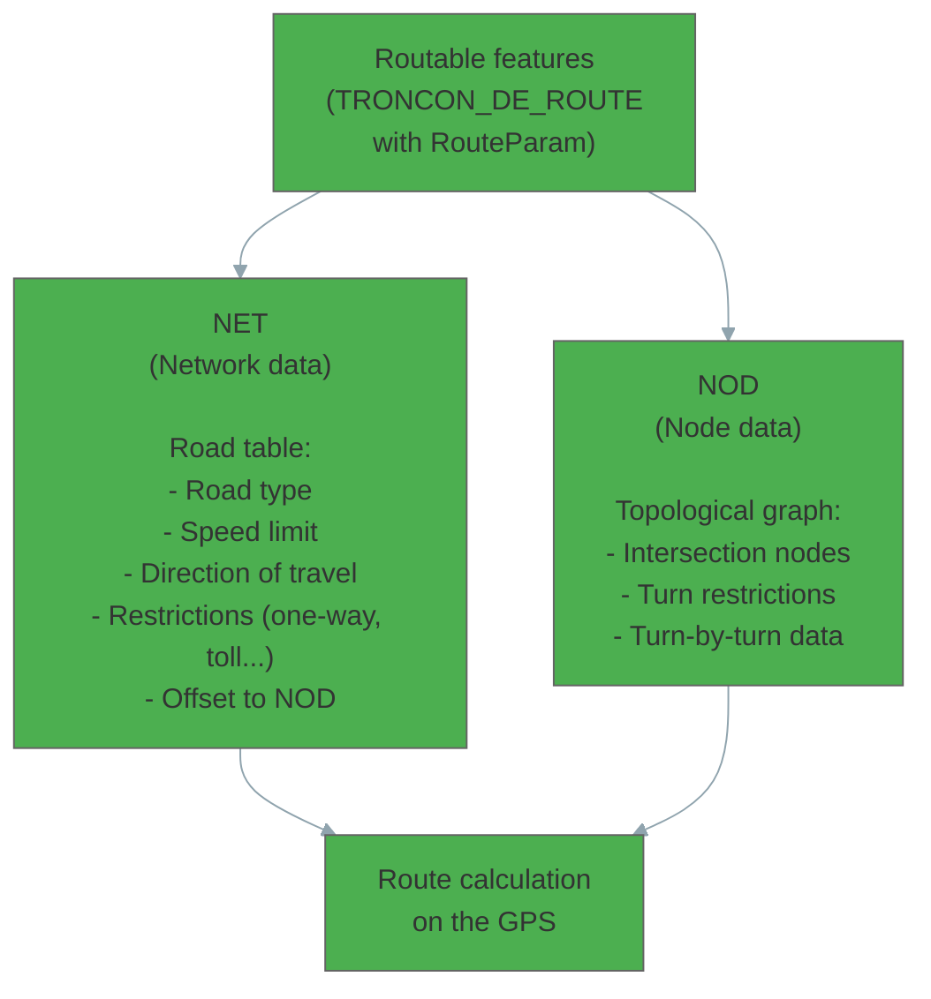
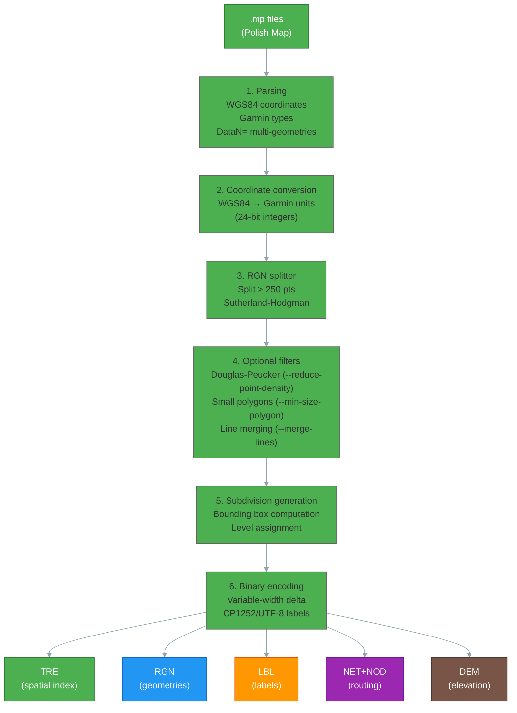

# The Garmin IMG Format — Architecture and Operation

This page provides a pedagogical explanation of the internal architecture of the Garmin IMG format — the binary format in which all Garmin maps are stored. It is based on public specifications (*imgformat-0.5* by John Mechalas, 2005), mkgmap r4924 sources, the imgdecode-1.1 decompiler, and imgforge source code.

<div style="display:flex;gap:1rem;align-items:center;margin-bottom:1rem">
  <a href="../../assets/resources/garmin-img-format-reference-fr.pdf" class="md-button md-button--primary" download>
    :material-file-pdf-box: Download the PDF reference document
  </a>
  <span style="font-size:.85em;color:var(--md-default-fg-color--light)">Complete version with all binary structures, enriched with project discoveries.</span>
</div>

---

## Overview

A Garmin `.img` file is **not** an image in the usual sense. It is a **miniature file system** — similar to a DOS floppy disk — that contains several sub-files encoded in little-endian. Each plays a precise role in rendering, routing or metadata.




!!! note "XOR byte — obfuscation, not encryption"
    All bytes in the container are XORed with the `xorbyte` (byte 0 of the file) on read/write. Since the key is **stored in the file itself**, the operation is trivially reversible — this is obfuscation, not encryption. Community maps (imgforge, mkgmap) always write `xorbyte = 0x00`. Commercial Garmin maps sometimes use a non-zero value, but without providing real security at this level.

---

## DSKIMG header

The header occupies the first 512 bytes and describes the "disk" geometry (block size, signatures, map metadata). Its structure intentionally resembles a DOS Master Boot Record.


The **block size** `2^(E1+E2)` is critical: it defines the granularity of all addresses in the FAT table. imgforge uses E1=9, E2=0 → 512-byte blocks by default. Larger blocks (1024, 2048 bytes) allow larger-capacity IMG files.

---

## Sub-file format

Each sub-file (TRE, RGN, LBL, NET, NOD, DEM) begins with an **identical 21-byte common header** — defined in mkgmap `CommonHeader.java` and reproduced in `imgforge/src/img/common_header.rs`.


### The `lock_flag` and the Garmin Lock system

This is where the **real DRM protection** of commercial Garmin maps (City Navigator, TOPO France...) resides, distinct from the container's XOR byte.

When `lock_flag = 0x80`, the Garmin firmware requires an **unlock code** linked to the device's hardware identifier (`unit ID`). The map is purchased for a specific device — at startup, the firmware checks the pair `(map Family ID, GPS unit ID)` before authorizing display. Without a valid code, the map appears in menus but remains invisible on screen. This is what MapInstall and myGarmin manage when purchasing paid maps.

**For our maps (imgforge):** `lock_flag = 0x00` in all sub-files — unlocked by definition, consistent with the open nature of IGN BDTOPO data.

---

## Garmin coordinates (map units)

The Garmin GPS uses its own coordinate system, not direct decimal degrees. Coordinates are encoded as **signed 32-bit integers** according to the formula:

```
garmin_coord = round(degree_coord × 2^(bits - 1) / 180)
```

For a map with 24-bit resolution (most detailed level):

```
1 unit = 180 / 2^23 ≈ 0.0000214 degrees ≈ 2.4 meters at the equator
```

| Resolution (bits) | Approximate precision | Usage |
|-------------------|-----------------------|-------|
| 24 | ~2 m | Maximum zoom, GPS detail |
| 23 | ~5 m | Intermediate level (7L header) |
| 22 | ~9 m | Neighborhood zoom |
| 21 | ~19 m | Intermediate level (7L header) |
| 20 | ~37 m | City zoom |
| 18 | ~150 m | Regional zoom |
| 16 | ~600 m | National zoom |

The levels in the Polish Map header (`level0: "24"`, `level1: "23"`...) directly correspond to these bit values. imgforge uses the 7-level header **24/23/22/21/20/18/16** for all production scopes.

---

## Subdivision: the basic rendering unit

The central concept of the IMG format is the **subdivision** (TRE/RGN subdivision). It is the elementary cell of spatial slicing — each tile contains a hierarchy of nested subdivisions.




Each subdivision is a rectangular area (bounding box + center) containing pointers to geographic elements in the RGN for a given zoom level. The Garmin firmware selects the subdivisions visible on screen and displays them — this is the "internal tiled" rendering engine.

**Subdivision structure** (16 bytes for non-leaf levels, 14 for level 0):

| Field | Size | Description |
|-------|------|-------------|
| `rgn_data_ptr` | 3 | Offset in the RGN file |
| `obj_types` | 1 | Bitmask of present types (0x10=pts, 0x20=indexed pts, 0x40=polylines, 0x80=polygons) |
| `longitude_center` | 3 | Center longitude (Garmin units) |
| `latitude_center` | 3 | Center latitude |
| `width` | 2 | Width + bit 15 = chain terminating flag |
| `height` | 2 | Height (Garmin units) |
| `next_level_subdivision` | 2 | Index of first subdivision at the lower level *(absent at level 0)* |

---

## TRE — Spatial index

The **TRE** sub-file (*Tree data*) is the brain of a tile. It contains:

1. **The map header** — bounding box, zoom levels, routing flag
2. **The subdivision table** — the list of all subdivisions with their bounding box and offsets in the RGN
3. **The overview sections** — for tiles participating in a multi-tile map

```
Common header (21 bytes)
  + TRE-specific header_length (188 bytes in standard mode)

Tile bounding box:
  max_lat  (24 bits, 3 bytes)
  max_lon  (24 bits, 3 bytes)
  min_lat  (24 bits, 3 bytes)
  min_lon  (24 bits, 3 bytes)

Zoom levels:
  levels_count (1 byte)       — number of levels
  Level0_bits  (1 byte)       — level 0 resolution (e.g.: 24)
  Level1_bits  (1 byte)       — level 1 resolution (e.g.: 23)
  ...

Section pointers:
  map_levels_offset / map_levels_size     (zoom levels)
  subdivisions_offset / subdivisions_size (subdivision list)
  polylines_defn_offset / ...             (type definitions)
  polygons_defn_offset / ...
  points_defn_offset / ...
```

### Overview levels (TRE overview section)

For tiles that participate in a multi-tile map, the TRE also contains an **overview section** with data from wide zoom levels (levels 7-9 in the 7L+ header). This section allows the firmware to display simplified borders and roads before having loaded the detailed tiles.

!!! note "History of the Alpha 100 wide-zoom bug"
    A critical bug (fixed in `7e68d62`) hardcoded `max_level=0` in the TRE overview section, making wide zoom levels invisible on the Alpha 100. The correct value must be `max_level = levels_count - 1`.

---

## RGN — Geometries

The **RGN** sub-file (*Region data*) contains all geometries encoded in variable-width delta.




### Delta bitstream encoding

Coordinates are **not** stored as absolute values but as **successive differences** (deltas). This reduces file sizes by 30 to 50%:


### 250-point limit

The RGN format imposes a limit of **250 points** per polyline/polygon segment. imgforge automatically splits features exceeding this limit:

- **Polylines**: segmented with 1 overlap point at junctions
- **Polygons**: split by recursive Sutherland-Hodgman clipping

---

## LBL — Labels

The **LBL** sub-file (*Label data*) contains all names (streets, cities, POIs...) in a compact format.

### Three supported encodings

| Format | Encoding | Bits per character | imgforge option |
|--------|----------|--------------------|-----------------|
| **Format 6** | Reduced 6-bit ASCII | 6 bits | default |
| **Format 9** | Windows code page (CP1252, CP1250...) | 8 bits | `--latin1` |
| **Format 10** | UTF-8 | variable | `--unicode` |

Format 6 is the most compact but only supports characters `A-Z`, `0-9` and space. For French maps, **Format 9 with CP1252** is recommended: it covers all French accented characters while remaining compact.

Labels are stored end-to-end with a `0x00` byte as separator. Polylines and polygons reference their label by an **offset** in this section (multiplied by the `label_multiplier` if > 0).

---

## NET and NOD — Routing

The **NET** and **NOD** sub-files implement the road topology for turn-by-turn navigation.



!!! danger "Experimental routing in imgforge"
    The road network generated by imgforge is **indicative only**. The NET/NOD graph is built from BDTOPO attributes (`VITESSE_MOYENNE_VL`, `ACCES_VL`, direction of travel) but coverage of complex restrictions (roundabouts, regulated access) is partial.

---

## DEM — Elevation

The **DEM** sub-file stores elevation data used for relief shading (hillshading) and altitude profiles on the GPS.

```
DEM header:
  bounding_box   (lat/lon min/max)
  zoom_levels    (number of levels)
  base_bits      (base precision)

For each zoom level:
  Section-header (60 bytes):
    distance     (spacing between points, in map units)
    rows × cols  (grid dimensions)
    data_offset  (offset +32 in the section-header)
    data_offset2 (offset +36)
  elevations[]   (delta-encoded, signed, in meters)
```

imgforge reads **HGT** files (SRTM NASA, 1/3 arc-second format) and **ASC** files (ESRI ASCII Grid — IGN BDAltiv2), reprojects them to WGS84 if necessary, and generates the multi-resolution DEM grid.

The `--dem-dists` parameter controls the spacing between elevation points per zoom level. A larger spacing reduces file size but degrades relief precision at low zoom.

!!! warning "DEM bug in GmpWriter"
    The `data_offset`/`data_offset2` offsets in DEM section-headers are at `+32` and `+36` — **not** `+20` and `+24` as initially coded. The error triggered an allocation of ~1290 DEM descriptors at Alpha 100 boot. Fixed in `relocate_dem`.

---

## TDB — Global metadata

The **TDB** sub-file (*Topo Data Block*) is unique in a `gmapsupp.img`. It contains the metadata for the entire map, used by PC software (BaseCamp, MapInstall):

```
Family ID     (u16)  — unique map family identifier
Product ID    (u16)  — product identifier
Family name         — "BDTOPO France"
Series name         — "IGN BDTOPO 2026"
Country, Region     — for BaseCamp catalog
Bounding boxes      — list of tiles with their extent
Copyright           — legal message
```

---

## TYP — Custom symbology

The **TYP** file is not tied to a specific tile: it is a dictionary of symbols (colors, fill patterns, icons) that replaces the firmware's default symbology for the Garmin types used in the map.

```
Section [_id]      — family identifier (must match TDB Family ID)
Section [Type0xNN] — polyline type definition
  String1=Main road
  Color=0xRRGGBB
  Width=3
Section [Type0xNN P]  — polygon type definition
Section [Type0xNN E]  — POI type definition
```

!!! warning "CP1252 encoding"
    The TYP file for this project (`I2023100.typ`) is generated by TYPViewer in **Windows-1252**. `imgforge typ compile --encoding cp1252` or automatic detection (`auto`) handle this file correctly.

---

## GMP — Consolidated Garmin NT format {#gmp--consolidated-garmin-nt-format}

The **GMP** format (*Garmin Map Product*) is a modern variant that groups a tile's sub-files into a **single FAT file** — eliminating 83% of FAT entries for a full France map.


### Implementation pitfalls — Alpha 100 firmware

The `GmpWriter` implementation required 5 hardware test cycles (GC1-GC5) to identify undocumented Alpha 100 firmware constraints:

| Pitfall | Symptom on Alpha 100 | Cause | Fix adopted |
|---------|---------------------|-------|------------|
| **NT extension of TRE** (`hlen=309`) | Invisible tile | TRE section descriptors[0xD0..0x134] at zero invalidate the record | Keep `hlen=188` (standard TRE) inside the GMP |
| **`tre10_rec_size = 0`** | Firmware crash | `count = size / rec_size` with `rec_size=0` → division by zero | Included in the `hlen=188` fix |
| **`relocate_dem` — wrong positions** | GMP not recognized with DEM | `data_offset` at `+32/+36` but code patched `+20/+24` → firmware allocates ~1290 descriptors | Correct `base+20/24` → `base+32/36` in `relocate_dem` |

!!! success "Validated in production on Alpha 100"
    `--packaging gmp` has been functional in production since April 2026, validated on Alpha 100 firmware
    with a complete IGN BD TOPO D038 build (BDAltiv2 altimetry data included).

---

## From Polish Map (.mp) to IMG file — the imgforge pipeline

The **Polish Map** format (`.mp`) is the intermediate text format between mpforge and imgforge. It describes features with their Garmin type, WGS84 coordinates, and metadata:

```
[IMG ID]
...
[POLYLINE]
Type=0x05          ; Garmin type (national road)
EndLevel=2         ; Disappears at zoom level 2
Label=RN7
RouteParam=3,0,0,0,0,0,0
Data0=(45.123,5.456),(45.127,5.461),(45.130,5.468)
Data2=(45.123,5.456),(45.130,5.468)      ; Simplified geometry level 2
[END]
```

imgforge reads these files and performs the following transformations:



---

## Format limits

| Limit | Value | Impact |
|-------|-------|--------|
| Points per polyline/polygon segment | 250 | imgforge splits automatically |
| Zoom levels | 10 (max) | Standard 7L Polish Map header + 3 overview |
| Sub-files per tile | ≤ 6 (`legacy`) or 1 (`gmp`) | NET/NOD absent without routing, DEM absent without `--dem` |
| Encoded label size | ~255 bytes | Very long labels truncated |
| Coordinate precision | 24 bits (~2 m) | Sufficient for road/outdoor mapping |
| gmapsupp FAT entries | Firmware-dependent | Alpha 100: RAM ceiling at boot → prefer `cell_size` ≥ 0.30° or GMP mode |

---

## Going further

| Resource | Local location | Content |
|----------|----------------|---------|
| imgformat-0.5 specification | `tmp/imgdecode-1.1/imgformat-0.5.pdf` | TRE, RGN, LBL, NET structures (John Mechalas, 2005) |
| imgdecode-1.1 | `tmp/imgdecode-1.1/` | Reference C++ decompiler |
| mkgmap r4924 | `tmp/mkgmap/` | Reference Java implementation |
| imgforge | `tools/imgforge/src/img/` | Rust implementation (this project) |
| PDF reference document | `site/assets/resources/garmin-img-format-reference-fr.pdf` | This project, printable version |
