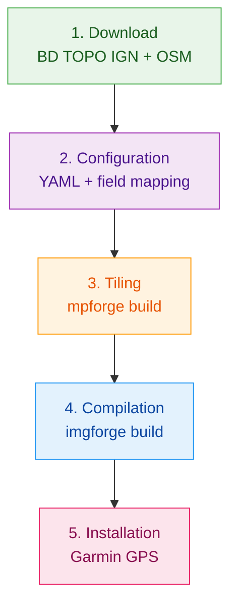

# The Production Pipeline

This section describes **step by step** the complete process of creating a Garmin topographic map from IGN BD TOPO data. Each step is illustrated with the actual commands to run.

<figure markdown>
  { width="100%" }
  <figcaption>From GIS dataset to Garmin GPS, without any manual step.</figcaption>
</figure>

---

## Overview

| Step | Tool | Input | Output | Typical duration |
|------|------|-------|--------|-----------------|
| 1. Download | `download-data.sh` | IGN URL + Geofabrik | `.gpkg` / `.shp` / `.osm.pbf` | 10-30 min |
| 2. Configuration | Text editor | - | `.yaml` | 5-15 min |
| 3. Tiling | `mpforge build` | `.gpkg` / `.shp` | `tiles/*.mp` | 30 min - 3h |
| 4. Compilation | `imgforge build` | `tiles/*.mp` | `gmapsupp.img` | 10 min - 1h |
| 5. Installation | File copy | `gmapsupp.img` | Garmin GPS | 2 min |

!!! info "Indicative durations"
    Durations depend on the geographic area (one department vs all of France), hardware, and the number of threads used. The figures above correspond to a standard workstation with 8 threads.
