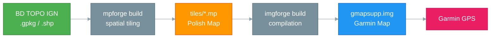

# The Project

**Free, accurate and up-to-date Garmin topographic maps — forged from IGN open data, with a 100% open-source pipeline.**

<figure markdown>
  { width="100%" }
  <figcaption>The declarative approach: your symbology rules in YAML, the tool forges the <code>.img</code>.</figcaption>
</figure>

---

## Why this project?

Garmin hiking GPS devices (fenix, Oregon, eTrex, Montana, Alpha...) use a proprietary map format: the **Garmin IMG**. To load your own geographic data onto a Garmin GPS, you need to produce a `gmapsupp.img` file — an opaque binary, not publicly documented, that only a few tools know how to generate.

Historically, the production chain relied on proprietary software (FME, Global Mapper, GPSMapEdit), freeware (cGPSmapper, GMapTool) or the open-source Java tool **mkgmap**. These tools exist and have helped advance the field — this project does not claim to be a silver bullet, but offers a **free and reproducible alternative** to this heterogeneous chain.

!!! warning "Known limitations"
    This project is an evolving personal work. Current limitations: experimental routing (hardcoded, not configurable), no handling of complex restrictions (tonnage, height), coverage limited to IGN BD TOPO data. Contributions and feedback are welcome.

## The FOSS approach

This project embodies an end-to-end approach:

1. **Data is open** — The IGN BD TOPO is available under the Etalab 2.0 license since January 1, 2021
2. **Tools are open-source** — ogr-polishmap under MIT license (GDAL compatibility), mpforge and imgforge under GPL v3 license (copyleft)
3. **The process is reproducible and extensible** — One script, one YAML configuration, and anyone can rebuild the map. The pipeline is not limited to BD TOPO: it is sufficient to adapt the YAML files to use other geographic data sources
4. **Zero proprietary dependency** — No FME, no Global Mapper, no GPSMapEdit, not even Java

!!! note "Supported platform"
    Binaries are currently compiled for **Linux x86_64 only**. A Windows build is conceivable for imgforge (pure Rust), but remains complex for mpforge (static GDAL linking).

### Before / After

| Criterion | Old pipeline | New pipeline |
|-----------|-------------|-------------|
| License | Proprietary FME + mkgmap (Java) | 100% open-source (MIT / GPL v3) |
| Automation | Manual, step by step | Full (scripts + CI/CD) |
| Reproducibility | Low (operator-dependent) | Total (declarative configuration) |
| Performance | Java, JVM overhead | Native binary, parallelized (Rust, rayon) |
| System dependencies | FME, Java JRE, GPSMapEdit | Rust, GDAL (or static binary) |
| Intermediate format | Manual editing in GPSMapEdit | Polish Map generated automatically |

## The three pillars of the project

The pipeline rests on three tools developed specifically for this project:

-   **ogr-polishmap** — The GDAL/OGR Driver

    ---

    A C++ driver that teaches GDAL how to read and write the Polish Map format (`.mp`). It is the founding brick: without it, it is impossible to convert standard GIS data to the intermediate format required by Garmin compilers.

    [:octicons-arrow-right-24: Learn more](ogr-polishmap.md)

-   **mpforge** — The Tile Forger

    ---

    A Rust CLI that slices massive geospatial data (Shapefile, GeoPackage) into Polish Map tiles, with parallelization, YAML field mapping, and JSON reports for CI/CD integration.

    [:octicons-arrow-right-24: Learn more](mpforge.md)

-   **imgforge** — The Garmin Compiler

    ---

    A Rust CLI that compiles Polish Map tiles into a binary Garmin IMG file. It replaces mkgmap with a single dependency-free binary, supporting multi-format encoding, routing, TYP symbology, and DEM/hill shading.

    [:octicons-arrow-right-24: Learn more](imgforge.md)

### Roadmap

!!! info "ogr-garminimg — Garmin IMG Driver *(coming soon)*"
    A future GDAL/OGR C++ driver to **read** Garmin IMG files (`.img`) natively. It will allow opening a `gmapsupp.img` directly in QGIS, ogr2ogr, or any GDAL tool — making the binary Garmin format finally accessible to the GIS ecosystem. This project is at the design stage.

## The data flow

## What the maps contain

A Garmin topographic map of France (or a region) including:

- **Roads and paths** — complete road network from the IGN BD TOPO
- **Hydrography** — rivers, lakes, wetlands, canals
- **Buildings and urban areas** — built-up area footprints
- **Vegetation** — forests, hedgerows, orchards, vineyards
- **Relief** — contour lines and shading (DEM/hill shading)
- **Toponymy** — place names, communes, massifs, summits
- **Routing** — turn-by-turn route calculation on GPS *(experimental — see warning below)*

!!! danger "Experimental routing"
    The road network is **routable on an experimental basis only**. Calculated routes are **indicative and non-prescriptive** — do not rely on them for navigation, regardless of the mode of transport.

    The routable network is currently **hardcoded** based on BD TOPO data attributes. Dynamic configuration based on source routable attributes is not yet supported.

!!! info "Source data"
    Maps are generated from the **IGN BD TOPO** — quarterly updates, metric precision, covering the entire French territory. Open license [Etalab 2.0](https://www.etalab.gouv.fr/licence-ouverte-open-licence).
