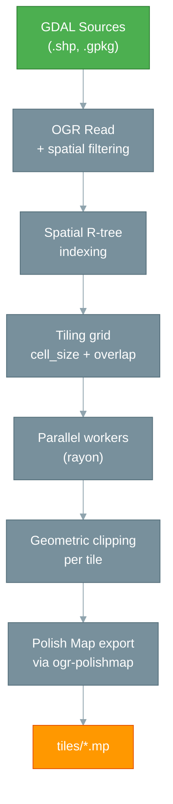

# mpforge — The Tile Forger

## The problem: massive data to slice

The IGN BD TOPO represents approximately **40 GB** of data for the southern half of France (Nouvelle-Aquitaine, Auvergne-Rhône-Alpes, Provence-Alpes-Côte d'Azur, Corse and Occitanie regions), with dozens of geographic layers (roads, buildings, hydrography, vegetation...). A Garmin GPS cannot digest a monolithic Polish Map file of this size. The data must be **sliced** into spatial tiles — manageable geographic chunks — then recombined during compilation.

This spatial tiling is a complex operation:

- Geometries must be clipped at tile boundaries
- Overlap must be managed to avoid visual artifacts
- Categorization rules must be applied (which Garmin type for which object?)
- Millions of features must be processed in a reasonable time

## The solution: `mpforge`

`mpforge` is a Rust CLI that orchestrates this entire process in a single command:

```bash
mpforge build --config france-bdtopo.yaml --jobs 8
```

Output: hundreds (or even thousands) of `.mp` files, each covering a portion of the territory, ready to be compiled by `imgforge`.

## Architecture



### What happens internally

1. **Reading** — `mpforge` opens all GDAL sources declared in the configuration
2. **Spatial filtering** — If configured, features are pre-filtered by a reference geometry (e.g.: communes)
3. **Indexing** — Features are indexed in a spatial R-tree for fast queries
4. **Grid** — A regular grid (configurable in degrees) is computed over the data extent
5. **Parallelization** — Each tile is processed by an independent worker (rayon)
6. **Clipping** — Geometries are clipped at the tile boundaries (with overlap)
7. **Generalization** — Optional smoothing (Chaikin) and simplification (Douglas-Peucker)
8. **Export** — The ogr-polishmap driver generates the `.mp` file with the configured field mapping

## `mpforge` CLI

### Commands

| Command | Description |
|---------|-------------|
| `mpforge build` | Executes the complete tiling pipeline |
| `mpforge validate` | Validates the configuration without executing the pipeline |

### `mpforge build` options

```bash
mpforge build --config <file.yaml> [options]
```

| Option | Description | Default |
|--------|-------------|---------|
| `--config <path>` | YAML configuration file (required) | - |
| `--input <path>` | Overrides the input path defined in the config | - |
| `--output <path>` | Overrides the output directory defined in the config | - |
| `--jobs <N>` | Number of parallel threads | `1` |
| `--report <path>` | Exports a JSON execution report | - |
| `--skip-existing` | Resumes an interrupted export by skipping already generated tiles | `false` |
| `--dry-run` | Preview mode: displays what would be exported without writing | `false` |
| `--disable-profiles` | Bypasses the external `generalize_profiles_path` catalog (inline `generalize:` remain active). Also accepts env var `MPFORGE_PROFILES=off`. See [Multi-level profiles](#multi-level-profiles) | `false` |
| `--fail-fast` | Immediate stop on first error | `false` |
| `-v` / `-vv` / `-vvv` | Progressive verbosity (INFO / DEBUG / TRACE) | - |

!!! info "Reading mpforge logs"
    Complete guide to log messages, verbosity levels, `RUST_LOG` filtering and JSON report format: [mpforge Logs](../reference/mpforge-logs.md).

Examples:

```bash
# Sequential mode (debug)
mpforge build --config config.yaml

# Production mode — 8 parallel threads
mpforge build --config config.yaml --jobs 8

# Resume an interrupted export
mpforge build --config config.yaml --jobs 8 --skip-existing

# Preview without writing (dry-run)
mpforge build --config config.yaml --dry-run

# With JSON report for CI/CD
mpforge build --config config.yaml --jobs 8 --report report.json
```

### `mpforge validate` options

```bash
mpforge validate --config <file.yaml> [options]
```

| Option | Description | Default |
|--------|-------------|---------|
| `--config <path>` | YAML configuration file (required) | - |
| `--report <path>` | Exports the result as JSON | - |
| `-v` / `-vv` / `-vvv` | Progressive verbosity | - |

Nine checks are performed:

| # | Check | Description |
|---|-------|-------------|
| 1 | `yaml_syntax` | Valid YAML syntax and correct types |
| 2 | `semantic_validation` | Business rules (grid, inputs, bbox, SRS, base_id, header, spatial_filter, generalize) |
| 3 | `input_files` | Existence of source files (after wildcard resolution) |
| 4 | `rules_file` | Parsing and validation of the rules file |
| 5 | `field_mapping` | Parsing of the GDAL field renaming file (optional — distinct from `garmin-rules.yaml`) |
| 6 | `header_template` | Presence of a header template file, or direct values in the `header:` section |
| 7 | `spatial_filter` | Existence of spatial filtering source files (grouped by unique source) |
| 8 | `generalize` | External catalog (`generalize_profiles_path`) and/or per-input inline directives |
| 9 | `label_case` | label_case consistency in rules (warning if no rule sets Label) |

Example output:

```
✓ yaml_syntax          — Parsed successfully
✓ semantic_validation  — All validations passed
✓ input_files          — 104 files found
✓ rules_file           — 28 rulesets, 351 rules total
- field_mapping        — Not configured (optional — renames raw GDAL attribute keys before applying garmin-rules.yaml)
✓ header_template      — Header configured (direct values, no template file)
✓ spatial_filter       — inputs #21-#103 (83): data/COMMUNE.shp (pattern)
✓ generalize           — catalog: ../generalize-profiles.yaml (8 profil(s), 84 niveau(x))
✓ label_case           — 20 ruleset(s): Voies ferrees: Title, Communes: Title, ...

Config valid. (7/10 checks passed)
```

Exit code: `0` if valid, `1` if invalid. The JSON report can be used in CI/CD.

### Parallelization

`mpforge` uses the **rayon** library (Rust) to distribute processing across N independent workers via the `--jobs` option. Each worker opens its own GDAL datasets — no shared state between threads.

```bash
# Sequential (debug, no parallelization)
mpforge build --config config.yaml --jobs 1

# 8 threads (production)
mpforge build --config config.yaml --jobs 8
```

| Dataset | Recommended `--jobs` | Typical speedup |
|---------|---------------------|----------------|
| < 50 tiles | `1` (sequential) | - |
| 50-500 tiles | `4` | ~2x |
| > 500 tiles | `8` | ~2-3x |

!!! warning "Warning"
    A `--jobs` value higher than the available CPU count is signaled by a warning and may degrade performance.

### Error handling

Two configurable modes in the YAML (`error_handling`) or via CLI (`--fail-fast`):

- **`continue`** (default) — Tiles in error are logged but processing continues. Ideal for production where a few problematic tiles should not block 2000 others.
- **`fail-fast`** — Immediate stop on first error. Ideal for development and debugging.

### JSON report

```json
{
  "status": "success",
  "tiles_generated": 2047,
  "tiles_failed": 0,
  "tiles_skipped": 150,
  "features_processed": 1234567,
  "skipped_additional_geom": 0,
  "duration_seconds": 1845.3,
  "errors": []
}
```

The `skipped_additional_geom` field counts features that were dropped because at least one additional `Data<n>=` bucket failed to write (FFI error `OGR_F_SetGeomField` ≠ NONE, or invalid WKT). It does not appear when the value is `0` (mono-Data mode). See [Multi-level profiles](#multi-level-profiles).

## Multi-level profiles {#multi-level-profiles}

`mpforge` can produce **multi-Data** `.mp` files: each feature carries multiple geometries (`Data0=` detailed, `Data2=` simplified for mid-zoom, etc.), selected by `imgforge` according to the zoom level. Two mechanisms coexist:

1. **Inline** in `sources.yaml` via `generalize:` — produces a single-level geometry (`n=0`).
2. **External catalog** `generalize_profiles_path: "./generalize-profiles.yaml"` — multi-level profiles by BD TOPO type, with attribute-based dispatch (e.g. `CL_ADMIN` for `TRONCON_DE_ROUTE`) and fail-fast bounds at load time (`iterations ∈ [0, 5]`, `simplify ∈ [0, 0.001]`).

Semantics of `n`: index in `MpHeader.levels` (0 = most detailed, emitted as `Data0=`). The `ogr-polishmap` driver serializes each bucket on a separate `Data<n>=` line.

See [Step 2 — Configuration](../the-pipeline/step-2-configuration.md#geometry-generalization) for the complete catalog schema and examples. The detailed catalog reference is available in [Generalization Profiles](../reference/generalize-profiles.md).

**Fail-fast constraints** at `load_config`:

- Any routable layer (`TRONCON_DE_ROUTE`) must declare `n: 0` in **each** visible branch (default + each `when`) — routing requires a `Data0=` to build the NET/NOD graph.
- Inline/external conflict on the same `source_layer` is rejected.
- `max(n)` across all profiles must be `< header.levels.len()` — otherwise `imgforge` silently drops out-of-range `DataN`.

**Opt-out**: `mpforge build --disable-profiles` bypasses only the external catalog (inline remains active).

## YAML Configuration

`mpforge` uses a declarative YAML file to define the entire pipeline. This file consists of two distinct parts:

1. **The sources configuration file** — Defines inputs, the grid, output, header and processing options
2. **The Garmin rules file** — Defines attribute transformations (types, labels, zoom levels)

The rules file is referenced by the configuration file via the `rules:` directive.

### Sources configuration file

Here is the complete structure, based on the production `sources.yaml` file:

```yaml
version: 1

grid:
  cell_size: 0.15       # ~16.5 km per tile (recommended for mkgmap/Garmin)
  overlap: 0.005        # Slight overlap to avoid edge artifacts

inputs:
  # Simple source with reprojection
  - path: "${DATA_ROOT}/TRANSPORT/TRONCON_DE_ROUTE.shp"
    source_srs: "EPSG:2154"
    target_srs: "EPSG:4326"

  # Source with geometry generalization
  - path: "${DATA_ROOT}/LIEUX_NOMMES/ZONE_D_HABITATION.shp"
    source_srs: "EPSG:2154"
    target_srs: "EPSG:4326"
    generalize:
      smooth: "chaikin"
      iterations: 1
      simplify: 0.00003

  # Wildcards + spatial filtering + attribute filter
  - path: "${CONTOURS_DATA_ROOT}/**/COURBE_*.shp"
    source_srs: "EPSG:2154"
    target_srs: "EPSG:4326"
    attribute_filter: "CAST(ALTITUDE AS INTEGER) = (CAST(ALTITUDE AS INTEGER) / 10) * 10"
    layer_alias: "COURBE"
    spatial_filter:
      source: "${DATA_ROOT}/ADMINISTRATIF/COMMUNE.shp"
      buffer: 500  # metres, in source SRS (EPSG:2154)

output:
  directory: "${OUTPUT_DIR}/mp/"
  filename_pattern: "BDTOPO-{col:03}-{row:03}.mp"
  overwrite: true
  base_id: ${BASE_ID}

header:
  name: "BDTOPO-{col:03}-{row:03}"
  copyright: "2026 Allfab Studio - IGN BDTOPO 2025"
  levels: "5"
  level0: "24"
  level1: "22"
  level2: "20"
  level3: "18"
  level4: "16"
  simplify_level: "0"
  tree_size: "1000"
  rgn_limit: "1024"
  lbl_coding: "9"
  routing: "Y"

# Reference to the Garmin rules file
rules: pipeline/configs/ign-bdtopo/departement/garmin-rules.yaml

error_handling: "continue"

# Bbox filter (WGS84) — optional
# filters:
#   bbox: [5.0, 44.6, 6.4, 45.9]
```

#### Per-source directives (`inputs`)

Each `inputs` entry can contain:

| Directive | Description | Required |
|-----------|-------------|----------|
| `path` | Path to the source file (supports `*`, `**` wildcards) | yes* |
| `connection` | PostGIS connection string (not implemented) | yes* |
| `source_srs` | Source data SRS (e.g.: `"EPSG:2154"`) | no |
| `target_srs` | Target SRS for reprojection (e.g.: `"EPSG:4326"`) | no |
| `layers` | List of layers to read (for multi-layer GeoPackage) | no |
| `layer_alias` | Forced layer name (for rules matching) | no |
| `attribute_filter` | SQL filter on attributes (OGR WHERE clause) | no |
| `generalize` | Geometry generalization configuration (see below) | no |
| `spatial_filter` | Spatial filtering configuration (see below) | no |

\* `path` or `connection`, one of the two is required (not both).

#### Spatial filtering (`spatial_filter`)

For large sources (contour lines, DEM...), `mpforge` allows **spatially filtering features** by a reference geometry before tiling. This drastically reduces the volume of data processed.

```yaml
inputs:
  - path: "${CONTOURS_DATA_ROOT}/**/COURBE_*.shp"
    source_srs: "EPSG:2154"
    target_srs: "EPSG:4326"
    spatial_filter:
      source: "${DATA_ROOT}/ADMINISTRATIF/COMMUNE.shp"  # Reference geometry
      buffer: 500                                         # Buffer in metres (source SRS)
```

| Option | Description | Default |
|--------|-------------|---------|
| `source` | Path to the reference shapefile (required) | - |
| `buffer` | Buffer distance in metres, in the source SRS | `0.0` |

The filter works by binary union (O(n log n)) of reference geometries, with envelope pre-rejection to optimize performance. Only features intersecting the resulting geometry (with buffer) are retained.

#### Geometry generalization (`generalize`) {#geometry-generalization}

`mpforge` integrates a generalization pipeline applied after clipping and before export. The `generalize` directive is a nested block within each source:

```yaml
inputs:
  - path: "${DATA_ROOT}/LIEUX_NOMMES/ZONE_D_HABITATION.shp"
    source_srs: "EPSG:2154"
    target_srs: "EPSG:4326"
    generalize:
      smooth: "chaikin"       # Chaikin smoothing (corner-cutting)
      iterations: 1           # Number of smoothing passes
      simplify: 0.00003       # Douglas-Peucker tolerance (in degrees)
```

| Option | Description | Default |
|--------|-------------|---------|
| `smooth` | Smoothing algorithm (only `"chaikin"` is supported) | - |
| `iterations` | Number of smoothing passes (minimum 1) | `1` |
| `simplify` | Post-smoothing Douglas-Peucker tolerance (in degrees) | - |

!!! tip "Production impact"
    On BD TOPO data (~35 GB), limit iterations to 1 to avoid excessive memory consumption. Douglas-Peucker simplification is optional and applied after smoothing.

#### Environment variables

Configuration files support **environment variables** with the `${VAR}` syntax. They are substituted before YAML parsing:

```yaml
inputs:
  - path: "${DATA_ROOT}/TRANSPORT/TRONCON_DE_ROUTE.shp"

output:
  directory: "${OUTPUT_DIR}/tiles/"
  base_id: ${BASE_ID}   # Also works for numeric fields
```

```bash
# Variables are resolved at startup
DATA_ROOT=/data/bdtopo OUTPUT_DIR=/output BASE_ID=38 \
  mpforge build --config config.yaml --jobs 8
```

Only valid POSIX variable names are recognized (`[A-Za-z_][A-Za-z0-9_]*`). Undefined variables are left as-is — `mpforge validate` reports them as warnings.

#### Field mapping

BD TOPO data uses field names like `MP_TYPE`, `NAME`, `MPBITLEVEL`. The Polish Map format expects `Type`, `Label`, `Levels`. Field mapping bridges the gap:

```yaml
# bdtopo-mapping.yaml
field_mapping:
  MP_TYPE: Type          # Garmin type code
  NAME: Label            # Object name
  Country: CountryName   # Country
  CityName: CityName     # Commune
  MPBITLEVEL: Levels     # Zoom levels
```

This separation into two files (config + mapping) allows **reusing** the same mapping for multiple configurations.

#### Header template

Each `.mp` tile needs a header with metadata (name, copyright, zoom levels). The header can be defined directly in the YAML or via an external template:

```yaml
# Directly in the YAML
header:
  name: "BDTOPO-{col:03}-{row:03}"
  copyright: "2026 Allfab Studio"
  levels: "5"
  level0: "24"
  level1: "22"
  level2: "20"

# OR via an external template
header:
  template: "header_template.mp"
```

### Garmin rules file

The rules file (`garmin-rules.yaml`) is a separate YAML file, referenced in the configuration via `rules:`. It defines how attributes from source features are transformed into Polish Map attributes (Garmin types, labels, zoom levels).

#### Structure

```yaml
version: 1

rulesets:
  - name: "Roads"
    source_layer: "TRONCON_DE_ROUTE"
    rules:
      - match:
          CL_ADMIN: "Autoroute"
        set:
          Type: "0x01"
          EndLevel: "2"
          Label: "~[0x04]${NUMERO}"

      - match:
          CL_ADMIN: "Nationale"
          NATURE: "!Rond-point"
        set:
          Type: "0x04"
          EndLevel: "2"
          Label: "~[0x05]${NUMERO}"
```

Each **ruleset** targets a source layer (`source_layer`) and contains a list of **rules** evaluated in **first-match-wins** order: the first rule whose all `match` conditions are satisfied is applied.

#### Matching operators

| Operator | Syntax | Description |
|----------|--------|-------------|
| Strict equality | `"Autoroute"` | Exact value |
| Wildcard | `"*"` | Always true |
| Not empty | `"!!"` | Field exists and is not empty |
| Empty | `""` | Field is absent or empty |
| In-list | `"in:val1,val2,val3"` | Membership in a list |
| Not-in-list | `"!in:val1,val2"` | Exclusion from a list |
| Starts-with | `"^prefix"` | Field starts with `prefix` |
| Starts-with (case-insensitive) | `"^i:prefix"` | Same, case-insensitive |
| Not-starts-with | `"!^prefix"` | Field does not start with `prefix` |
| Not-equal | `"!value"` | Different from `value` |

#### Field substitution

In `set` values, the `${FIELD}` syntax substitutes the source attribute value:

```yaml
set:
  Label: "~[0x04]${NUMERO}"   # → "~[0x04]A7"
  Label: "${TOPONYME}"          # → "Mont Blanc"
```

#### Label case formatting (`label_case`)

The `label_case` option controls the case of labels written in MP files. It can be defined at the **ruleset** level (default for all rules) or at an **individual rule** level (ruleset override).

| Value | Description | Example |
|-------|-------------|---------|
| `none` | No change (default) | `"Mont Blanc"` → `"Mont Blanc"` |
| `upper` | All uppercase | `"Mont Blanc"` → `"MONT BLANC"` |
| `lower` | All lowercase | `"Mont Blanc"` → `"mont blanc"` |
| `title` | Title case | `"mont blanc"` → `"Mont Blanc"` |
| `capitalize` | First letter capitalized | `"mont blanc"` → `"Mont blanc"` |

Garmin prefixes (`~[0xNN]`) are preserved: only the text part is transformed.

```yaml
- name: "Toponymy"
  source_layer: "TOPONYMIE"
  label_case: "title"        # Default for the whole ruleset
  rules:
    - match:
        CLASSE: "Montagne"
      set:
        Type: "0x6616"
        Label: "${GRAPHIE}"
      label_case: "upper"    # Override: summits in uppercase
```

## Supported sources

`mpforge` reads **all GDAL/OGR file formats**:

| Format | Type | Example |
|--------|------|---------|
| ESRI Shapefile | File | `data/routes.shp` |
| GeoPackage | File | `data/bdtopo.gpkg` |
| GeoJSON | File | `data/features.geojson` |
| KML/KMZ | File | `data/map.kml` |

!!! note "PostGIS"
    PostGIS connection strings are recognized by the configuration parser, but actual data reading is not yet implemented in the pipeline. Planned for a future version.

## Installation

### Pre-compiled binary (recommended)

The static binary includes **PROJ 9.3.1, GEOS 3.13.0, GDAL 3.10.1 and the ogr-polishmap driver built-in**. Zero configuration required:

```bash
# Download and extract the archive
wget https://github.com/allfab/garmin-img-forge/releases/download/mpforge-v0.5.0/mpforge-linux-amd64.tar.gz
tar xzf mpforge-linux-amd64.tar.gz

chmod +x mpforge
sudo mv mpforge /usr/local/bin/
mpforge --version
```

!!! info "Understanding `--version` output"
    The `-N-g<hash>` and `-dirty` suffixes have specific meanings — see the [Binary Versioning](../reference/binary-versioning.md) page for the complete version reading guide and the release workflow.

### Compilation from sources

```bash
# Prerequisites: Rust 1.70+ and GDAL 3.0+
cd tools/mpforge
cargo build --release
```
