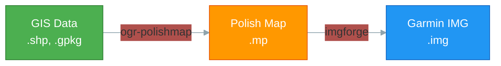

# ogr-polishmap — The GDAL/OGR Driver

## The problem: a poorly supported format

The **Polish Map** format (`.mp`) is the indispensable intermediate format for creating Garmin maps. It is an INI-style text format, invented by the cGPSmapper software in the 2000s, which describes points of interest (POI), lines (roads, rivers) and polygons (forests, lakes, buildings) with their Garmin type codes.

**The problem**: no major GIS tool — neither open-source (QGIS) nor proprietary (ArcGIS) — can read or write this format natively, and none of the 200+ formats supported by GDAL/OGR covers it. Only **Global Mapper** (proprietary, paid license) can read and save the Polish Map format — it is through this tool that I was able to understand the structure of the `.mp` format. For everything else, one had to use GPSMapEdit (proprietary, Windows only) or write fragile ad hoc scripts.

## The solution: a native GDAL driver

**ogr-polishmap** is a C++ driver that integrates directly into GDAL/OGR — the world reference library for geospatial data. Once installed, the Polish Map format becomes a first-class citizen in the entire GDAL ecosystem:

```bash
# Convert a Shapefile to Polish Map
ogr2ogr -f "PolishMap" output.mp COMMUNE.shp

# Convert a Polish Map to GeoJSON
ogr2ogr -f "GeoJSON" output.geojson input.mp

# Read a Polish Map in QGIS
# → Open the .mp file directly like any other format
```

This means that **all GDAL-based tools** (QGIS, ogr2ogr, Python/GDAL, R/sf, PostGIS...) can now manipulate Polish Map files natively.

## Features

| Feature | Read | Write |
|---------|------|-------|
| POI (Point) | Yes | Yes |
| POLYLINE (LineString) | Yes | Yes |
| POLYGON (Polygon) | Yes | Yes |
| Attribute fields | Yes | Yes |
| Spatial filter | Yes | N/A |
| Attribute filter | Yes | N/A |
| UTF-8 labels | Yes | Yes (auto CP1252 conversion) |
| Multi-geometry decomposition | N/A | Yes (MultiPolygon to N Polygon) |
| YAML field mapping | N/A | Yes (`-dsco FIELD_MAPPING`) |
| Multi-geometry fields (Data1..DataK) | Yes (`-oo MULTI_GEOM_FIELDS=YES`) | Yes (`-dsco MULTI_GEOM_FIELDS=YES`) |

## Multi-geometry fields

POLYLINE and POLYGON layers can carry **N geometries per feature** (up to `Data9=`), consumed by `imgforge` at the corresponding zoom level. POI remains single-geometry (MP spec §4.4.3.1).

**Write activation** — the driver adds N-1 additional `OGRGeomFieldDefn` (`geom_level_1`..`geom_level_K`) when `MULTI_GEOM_FIELDS=YES`:

```bash
ogr2ogr -f "PolishMap" out.mp in.shp \
    -dsco MULTI_GEOM_FIELDS=YES \
    -dsco MAX_DATA_LEVEL=4
```

The writer serializes each non-empty bucket on a separate `Data<n>=` line. Gaps are allowed (`Data0=` + `Data2=` without `Data1=`).

**Read activation** (strict opt-in) — without the option, `DataN>0` lines are parsed internally but not exposed via OGR (predictable, backward-compatible behavior):

```bash
ogr2ogr -f "GeoJSON" out.geojson in.mp \
    -oo MULTI_GEOM_FIELDS=YES \
    -oo MAX_DATA_LEVEL=4
```

The layer then exposes `GetGeomFieldCount() == K + 1`.

**Validation**: `MAX_DATA_LEVEL ∈ [1, 9]` (`Create()` failure out of bounds). Without the option, output strictly identical to the v2026.03 driver (validated bit-by-bit by the golden test).

See [mpforge — multi-level profiles](mpforge.md#multi-level-profiles) for usage on the `.mp` producer side.

## YAML field mapping

The driver supports configurable field name mapping. When your source data uses custom column names (`MP_TYPE`, `NAME`), the field mapping automatically transposes them to standard Polish Map fields (`Type`, `Label`):

```yaml
# bdtopo-mapping.yaml
field_mapping:
  MP_TYPE: Type          # Garmin type code (e.g.: 0x4e00)
  NAME: Label            # Feature name
  Country: CountryName   # Country
  MPBITLEVEL: Levels     # Zoom levels
```

```bash
ogr2ogr -f "PolishMap" communes.mp COMMUNE.shp \
    -dsco FIELD_MAPPING=bdtopo-mapping.yaml
```

## The Polish Map format in detail

### Structure of a .mp file

A Polish Map file is a text file structured in INI sections. Each file begins with an `[IMG ID]` header followed by a series of geographic objects:

```
[IMG ID]
Name=My Map
CodePage=1252
ID=12345678
[END]

[POI]
Type=0x2C00
Label=Restaurant
Data0=(48.8566,2.3522)
[END]

[POLYLINE]
Type=0x0001
Label=Main Road
Data0=(48.8500,2.3400),(48.8550,2.3500),(48.8600,2.3450)
[END]

[POLYGON]
Type=0x0050
Label=Chartreuse Forest
Data0=(45.35,5.78),(45.36,5.79),(45.35,5.80),(45.35,5.78)
[END]
```

### Fundamental rules

- **Coordinates** in WGS84 (EPSG:4326), format `(latitude,longitude)` in decimal degrees
- **Encoding** CP1252 by default (UTF-8 via `CodePage=65001`)
- Each object has a **Type** (Garmin hexadecimal code) that determines rendering on the GPS
- Polygons must be **closed** (first point = last point)
- Maximum **1024 points** per polyline

### Why this intermediate format?

The Garmin IMG format is an opaque and complex binary. Polish Map serves as a **readable representation** between GIS data and the final binary:



ogr-polishmap's role is on the **first arrow**: converting GIS data to the Polish Map format. The second step (Polish Map → Garmin IMG) is handled by imgforge.

It is this two-step architecture that makes the pipeline modular and debuggable. You can inspect `.mp` files at any time to verify that the data is correctly transformed before the final compilation.

## GDAL Compliance

The driver is **100% compliant** with the 12 GDAL/OGR conventions (February 2026 audit):

- Standard registration pattern (plugin + built-in)
- OGR naming conventions (PascalCase, Hungarian prefixes)
- Exclusive CPL logging (no printf/cout)
- Correct reference counting on FeatureDefn and SRS
- RAII ownership (unique_ptr, dataset owns layers)
- Per-layer spatial and attribute filters
- Capabilities (TestCapability, GDAL_DMD_* metadata)
- CMake 3.20+ build (C++17, in-tree and out-of-tree)
- No external dependencies (stdlib + GDAL only)
- Complete C++ test suite (14 files)

## Installation

### Linux (Debian/Ubuntu)

```bash
# Dependencies
sudo apt-get install -y libgdal-dev gdal-bin cmake g++

# Build
cd tools/ogr-polishmap
mkdir build && cd build
cmake .. -DCMAKE_BUILD_TYPE=Release
make -j$(nproc)

# Install as GDAL plugin
sudo cp ogr_PolishMap.so $(gdal-config --plugindir)/

# Verify
ogrinfo --formats | grep -i polish
# → PolishMap -vector- (rw+v): Polish Map Format (*.mp)
```

### Windows / QGIS (via OSGeo4W)

```cmd
cd tools\ogr-polishmap
cmake -B build -G "NMake Makefiles" -DCMAKE_BUILD_TYPE=Release ^
    -DGDAL_INCLUDE_DIR=C:/OSGeo4W/include ^
    -DGDAL_LIBRARY=C:/OSGeo4W/lib/gdal_i.lib
cmake --build build

copy build\ogr_PolishMap.dll C:\OSGeo4W\apps\gdal\lib\gdalplugins\
```

After restarting QGIS, `.mp` files open directly.

## Python

```python
from osgeo import ogr, gdal
gdal.UseExceptions()

# Read
ds = ogr.Open("sample.mp")
for i in range(ds.GetLayerCount()):
    layer = ds.GetLayer(i)
    print(f"Layer: {layer.GetName()}, Features: {layer.GetFeatureCount()}")
    for feature in layer:
        print(f"  Type: {feature.GetField('Type')}, Label: {feature.GetField('Label')}")

# Write
driver = ogr.GetDriverByName("PolishMap")
ds = driver.CreateDataSource("output.mp")
poi_layer = ds.GetLayer(0)

feature = ogr.Feature(poi_layer.GetLayerDefn())
feature.SetField("Type", "0x2C00")
feature.SetField("Label", "Restaurant")
point = ogr.Geometry(ogr.wkbPoint)
point.AddPoint(2.3522, 48.8566)
feature.SetGeometry(point)
poi_layer.CreateFeature(feature)
ds = None
```
