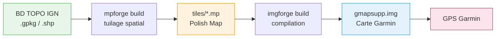

# Le Projet MPForge

**Des cartes topographiques Garmin gratuites, précises et à jour — forgées depuis les données ouvertes de l'IGN, avec un pipeline 100 % open-source.**

---

## Pourquoi ce projet ?

Les GPS Garmin de randonnée (fenix, Oregon, eTrex, Montana, Alpha...) utilisent un format de carte propriétaire : le **Garmin IMG**. Pour charger vos propres données géographiques sur un GPS Garmin, il faut produire un fichier `gmapsupp.img` — un binaire opaque, non documenté publiquement, que seuls quelques outils savent générer.

Historiquement, la chaîne de production reposait sur des logiciels propriétaires (FME, GPSMapEdit) ou sur l'outil Java open-source **mkgmap**. Notre ambition : **remplacer l'intégralité de cette chaîne par des outils FOSS modernes, écrits en Rust et C++**, capables de traiter les données massives de la BD TOPO IGN (35 Go+) de manière automatisée et reproductible.

## La démarche FOSS

Ce projet incarne une démarche de bout en bout :

1. **Les données sont ouvertes** — La BD TOPO IGN est disponible sous licence Etalab 2.0 depuis le 1er janvier 2021
2. **Les outils sont open-source** — Chaque maillon du pipeline est développé et publié sous licence MIT
3. **Le processus est reproductible** — Un script, une configuration YAML, et n'importe qui peut reconstruire la carte
4. **Zéro dépendance propriétaire** — Ni FME, ni GPSMapEdit, ni même Java

### Avant / Après

| Critère | Ancien pipeline | Nouveau pipeline |
|---------|----------------|-----------------|
| Licence | FME propriétaire + mkgmap (Java) | 100 % open-source (MIT) |
| Automatisation | Manuelle, étape par étape | Complète (scripts + CI/CD) |
| Reproductibilité | Faible (dépend de l'opérateur) | Totale (configuration déclarative) |
| Performance | Lente (Java, mono-thread) | Parallélisée (Rust, rayon) |
| Dépendances système | FME, Java JRE, GPSMapEdit | Rust, GDAL (ou binaire statique) |
| Format intermédiaire | Édition manuelle dans GPSMapEdit | Polish Map généré automatiquement |

## Les trois piliers du projet

Le pipeline repose sur trois outils développés spécifiquement pour ce projet :

-   **ogr-polishmap** — Le Driver GDAL/OGR

    ---

    Un driver C++ qui enseigne à GDAL comment lire et écrire le format Polish Map (`.mp`). C'est la brique fondatrice : sans lui, impossible de convertir des données SIG standard vers le format intermédiaire requis par les compilateurs Garmin.

    [:octicons-arrow-right-24: En savoir plus](ogr-polishmap.md)

-   **mpforge** — Le Forgeron de tuiles

    ---

    Un CLI Rust qui découpe des données géospatiales massives (Shapefile, GeoPackage, PostGIS) en tuiles Polish Map, avec parallélisation, field mapping YAML et rapports JSON pour l'intégration CI/CD.

    [:octicons-arrow-right-24: En savoir plus](mpforge.md)

-   **imgforge** — Le Compilateur Garmin

    ---

    Un CLI Rust qui compile les tuiles Polish Map en fichier binaire Garmin IMG. Il remplace mkgmap avec un binaire unique sans dépendance, supportant l'encodage multi-format, le routing, la symbologie TYP et le DEM/hill shading.

    [:octicons-arrow-right-24: En savoir plus](imgforge.md)

## Le flux de données

## Ce que produisent les cartes

Une carte Garmin topographique de la France (ou d'une région) incluant :

- **Routes et chemins** — réseau routier complet de la BD TOPO IGN
- **Hydrographie** — rivières, lacs, zones humides, canaux
- **Bâtiments et zones urbanisées** — emprise du bâti
- **Végétation** — forêts, haies, vergers, vignes
- **Relief** — courbes de niveau et ombrage (DEM/hill shading)
- **Toponymie** — noms de lieux, communes, massifs, sommets
- **Routing** — calcul d'itinéraire turn-by-turn sur le GPS

!!! info "Données sources"
    Les cartes sont générées depuis la **BD TOPO IGN** — mise à jour semestrielle, précision métrique, couvrant l'ensemble du territoire français. Licence ouverte [Etalab 2.0](https://www.etalab.gouv.fr/licence-ouverte-open-licence).
