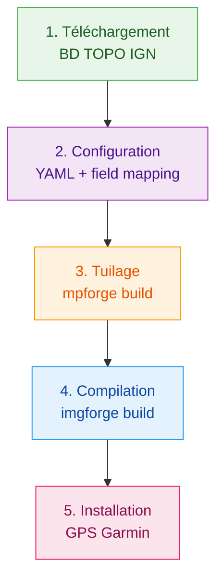

# Le Pipeline de fabrication

Cette section décrit **étape par étape** le processus complet de création d'une carte Garmin topographique à partir des données IGN BD TOPO. Chaque étape est illustrée avec les commandes réelles à exécuter.

---

## Vue d'ensemble

| Étape | Outil | Entrée | Sortie | Durée typique |
|-------|-------|--------|--------|---------------|
| 1. Téléchargement | `download-bdtopo.sh` | URL IGN | `.gpkg` / `.shp` | 10-30 min |
| 2. Configuration | Éditeur texte | - | `.yaml` | 5-15 min |
| 3. Tuilage | `mpforge build` | `.gpkg` / `.shp` | `tiles/*.mp` | 30 min - 3h |
| 4. Compilation | `imgforge build` | `tiles/*.mp` | `gmapsupp.img` | 10 min - 1h |
| 5. Installation | Copie fichier | `gmapsupp.img` | GPS Garmin | 2 min |

!!! info "Durées indicatives"
    Les durées dépendent de la zone géographique (un département vs la France entière), du matériel, et du nombre de threads utilisés. Les chiffres ci-dessus correspondent à un poste de travail standard avec 8 threads.
