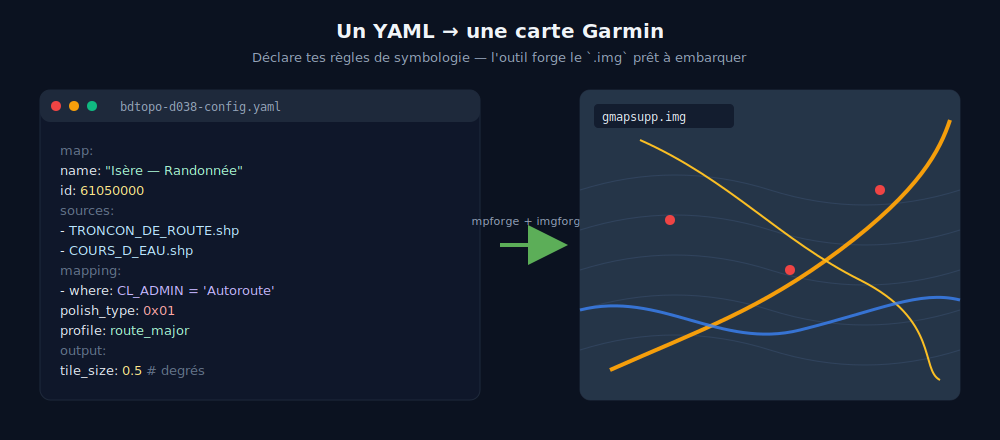

# Le Projet

**Des cartes topographiques Garmin gratuites, précises et à jour — forgées depuis les données ouvertes de l'IGN, avec un pipeline 100 % open-source.**

<figure markdown>
  { width="100%" }
  <figcaption>L'approche déclarative : tes règles de symbologie en YAML, l'outil forge le <code>.img</code>.</figcaption>
</figure>

---

## Pourquoi ce projet ?

Les GPS Garmin de randonnée (fenix, Oregon, eTrex, Montana, Alpha...) utilisent un format de carte propriétaire : le **Garmin IMG**. Pour charger vos propres données géographiques sur un GPS Garmin, il faut produire un fichier `gmapsupp.img` — un binaire opaque, non documenté publiquement, que seuls quelques outils savent générer.

Historiquement, la chaîne de production reposait sur des logiciels propriétaires (FME, Global Mapper, GPSMapEdit), des freeware (cGPSmapper, GMapTool) ou sur l'outil Java open-source **mkgmap**. Ces outils existent et ont permis de faire avancer le sujet — ce projet ne prétend pas être une solution miracle, mais propose une **alternative libre et reproductible** à cette chaîne hétérogène.

!!! warning "Limitations connues"
    Ce projet est un travail personnel en évolution. Limitations actuelles : routing expérimental (codé en dur, non configurable), pas de gestion des restrictions complexes (tonnage, hauteur), couverture limitée aux données BD TOPO IGN. Les contributions et retours sont les bienvenus.

## La démarche FOSS

Ce projet incarne une démarche de bout en bout :

1. **Les données sont ouvertes** — La BD TOPO IGN est disponible sous licence Etalab 2.0 depuis le 1er janvier 2021
2. **Les outils sont open-source** — ogr-polishmap sous licence MIT (compatibilité GDAL), mpforge et imgforge sous licence GPL v3 (copyleft)
3. **Le processus est reproductible et extensible** — Un script, une configuration YAML, et n'importe qui peut reconstruire la carte. Le pipeline n'est pas limité à la BD TOPO : il suffit d'adapter les fichiers YAML pour utiliser d'autres sources de données géographiques
4. **Zéro dépendance propriétaire** — Ni FME, ni Global Mapper, ni GPSMapEdit, ni même Java

!!! note "Plateforme supportée"
    Les binaires sont actuellement compilés pour **Linux x86_64 uniquement**. Une compilation pour Windows est envisageable pour imgforge (pur Rust), mais reste complexe pour mpforge (liaison statique GDAL).

### Avant / Après

| Critère | Ancien pipeline | Nouveau pipeline |
|---------|----------------|-----------------|
| Licence | FME propriétaire + mkgmap (Java) | 100 % open-source (MIT / GPL v3) |
| Automatisation | Manuelle, étape par étape | Complète (scripts + CI/CD) |
| Reproductibilité | Faible (dépend de l'opérateur) | Totale (configuration déclarative) |
| Performance | Java, overhead JVM | Binaire natif, parallélisée (Rust, rayon) |
| Dépendances système | FME, Java JRE, GPSMapEdit | Rust, GDAL (ou binaire statique) |
| Format intermédiaire | Édition manuelle dans GPSMapEdit | Polish Map généré automatiquement |

## Les trois piliers du projet

Le pipeline repose sur trois outils développés spécifiquement pour ce projet :

-   **ogr-polishmap** — Le Driver GDAL/OGR

    ---

    Un driver C++ qui enseigne à GDAL comment lire et écrire le format Polish Map (`.mp`). C'est la brique fondatrice : sans lui, impossible de convertir des données SIG standard vers le format intermédiaire requis par les compilateurs Garmin.

    [:octicons-arrow-right-24: En savoir plus](ogr-polishmap.md)

-   **mpforge** — Le Forgeron de tuiles

    ---

    Un CLI Rust qui découpe des données géospatiales massives (Shapefile, GeoPackage) en tuiles Polish Map, avec parallélisation, field mapping YAML et rapports JSON pour l'intégration CI/CD.

    [:octicons-arrow-right-24: En savoir plus](mpforge.md)

-   **imgforge** — Le Compilateur Garmin

    ---

    Un CLI Rust qui compile les tuiles Polish Map en fichier binaire Garmin IMG. Il remplace mkgmap avec un binaire unique sans dépendance, supportant l'encodage multi-format, le routing, la symbologie TYP et le DEM/hill shading.

    [:octicons-arrow-right-24: En savoir plus](imgforge.md)

### Roadmap

!!! info "ogr-garminimg — Driver Garmin IMG *(à venir)*"
    Un futur driver GDAL/OGR C++ pour **lire** nativement les fichiers Garmin IMG (`.img`). Il permettra d'ouvrir directement un `gmapsupp.img` dans QGIS, ogr2ogr ou tout outil GDAL — rendant le format binaire Garmin enfin accessible à l'écosystème SIG. Ce projet est au stade de conception.

## Le flux de données

## Ce que produisent les cartes

Une carte Garmin topographique de la France (ou d'une région) incluant :

- **Routes et chemins** — réseau routier complet de la BD TOPO IGN
- **Hydrographie** — rivières, lacs, zones humides, canaux
- **Bâtiments et zones urbanisées** — emprise du bâti
- **Végétation** — forêts, haies, vergers, vignes
- **Relief** — courbes de niveau et ombrage (DEM/hill shading)
- **Toponymie** — noms de lieux, communes, massifs, sommets
- **Routing** — calcul d'itinéraire turn-by-turn sur le GPS *(expérimental — voir avertissement ci-dessous)*

!!! danger "Routing expérimental"
    Le réseau routier est **routable à titre expérimental uniquement**. Les itinéraires calculés sont **indicatifs et non prescriptifs** — ne vous y fiez pas pour la navigation, quel que soit le mode de déplacement.

    Le réseau routable est actuellement **codé en dur** en fonction des données de la BD TOPO. La configuration dynamique basée sur les attributs routables de la source n'est pas encore supportée.

!!! info "Données sources"
    Les cartes sont générées depuis la **BD TOPO IGN** — mise à jour trimestrielle, précision métrique, couvrant l'ensemble du territoire français. Licence ouverte [Etalab 2.0](https://www.etalab.gouv.fr/licence-ouverte-open-licence).

## Démo

  <iframe
    src="https://www.youtube-nocookie.com/embed/ML7Q7NLF7Ew"
    title="Garmin IMG Forge — Démo"
    loading="lazy"
    referrerpolicy="strict-origin-when-cross-origin"
    allow="accelerometer; autoplay; clipboard-write; encrypted-media; gyroscope; picture-in-picture; web-share"
    allowfullscreen>
    <a href="https://www.youtube.com/watch?v=ML7Q7NLF7Ew">Voir la démo sur YouTube</a>
  </iframe>

