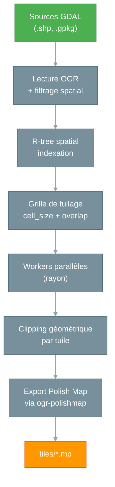

# mpforge — Le Forgeron de tuiles

## Le problème : des données massives à découper

La BD TOPO IGN représente environ **40 Go** de données pour la moitié sud de la France (régions Nouvelle-Aquitaine, Auvergne-Rhône-Alpes, Provence-Alpes-Côte d'Azur, Corse et Occitanie), avec des dizaines de couches géographiques (routes, bâtiments, hydrographie, végétation...). Un GPS Garmin ne peut pas digérer un fichier Polish Map monolithique de cette taille. Il faut **découper** les données en tuiles spatiales — des morceaux géographiques gérables — puis les recombiner à la compilation.

Ce tuilage spatial est une opération complexe :

- Il faut découper les géométries aux frontières des tuiles
- Gérer le chevauchement (overlap) pour éviter les artefacts visuels
- Appliquer des règles de catégorisation (quel type Garmin pour quel objet ?)
- Traiter des millions de features en temps raisonnable

## La solution : mpforge

**mpforge** est un CLI Rust qui orchestre tout ce processus en une seule commande :

```bash
mpforge build --config france-bdtopo.yaml --jobs 8
```

En sortie : des centaines (voire des milliers) de fichiers `.mp`, chacun couvrant une portion du territoire, prêts à être compilés par `imgforge`.

## Architecture



### Ce qui se passe en interne

1. **Lecture** — mpforge ouvre toutes les sources GDAL déclarées dans la configuration
2. **Filtrage spatial** — Si configuré, les features sont pré-filtrées par une géométrie de référence (ex: communes)
3. **Indexation** — Les features sont indexées dans un R-tree spatial pour des requêtes rapides
4. **Grille** — Une grille régulière (configurable en degrés) est calculée sur l'emprise des données
5. **Parallélisation** — Chaque tuile est traitée par un worker indépendant (rayon)
6. **Clipping** — Les géométries sont découpées aux frontières de la tuile (avec overlap)
7. **Généralisation** — Lissage (Chaikin) et simplification (Douglas-Peucker) optionnels
8. **Export** — Le driver ogr-polishmap génère le fichier `.mp` avec le field mapping configuré

## Configuration YAML

mpforge utilise un fichier YAML déclaratif pour définir l'intégralité du pipeline :

```yaml
version: 1

grid:
  cell_size: 0.15      # ~16.5 km par tuile
  overlap: 0.01        # Chevauchement entre tuiles
  origin: [-5.0, 41.0] # Point d'origine optionnel

inputs:
  # Shapefiles avec wildcards
  - path: "data/bdtopo/*.shp"

  # GeoPackage multi-couches
  - path: "data/BDTOPO.gpkg"
    layers:
      - "batiment"
      - "troncon_de_route"
      - "cours_d_eau"
      - "zone_vegetation"

  # Filtrage spatial par géométrie de référence
  - path: "data/COURBES_NIVEAU.shp"
    spatial_filter:
      source: "data/COMMUNE.shp"
      buffer: 500  # mètres dans le SRS source

  # PostGIS (non implémenté — prévu dans une future version)
  # - connection: "PG:host=localhost dbname=gis"
  #   layers: ["roads", "buildings"]

output:
  directory: "tiles/"
  filename_pattern: "{col}_{row}.mp"
  field_mapping_path: "bdtopo-mapping.yaml"

header:
  template: "header_template.mp"

filters:
  bbox: [-5.0, 41.0, 10.0, 51.5]  # France métropolitaine

error_handling: "continue"
```

### Variables d'environnement

Les fichiers de configuration supportent les **variables d'environnement** avec la syntaxe `${VAR}`. Elles sont substituées avant le parsing YAML, ce qui permet de paramétrer les chemins et valeurs numériques sans modifier le fichier :

```yaml
inputs:
  - path: "${DATA_ROOT}/TRANSPORT/TRONCON_DE_ROUTE.shp"
  - path: "${DATA_ROOT}/HYDROGRAPHIE/*.shp"

output:
  directory: "${OUTPUT_DIR}/tiles/"
  base_id: ${BASE_ID}   # Fonctionne aussi pour les champs numériques
```

```bash
# Les variables sont résolues au lancement
DATA_ROOT=/data/bdtopo OUTPUT_DIR=/output BASE_ID=38 \
  mpforge build --config config.yaml --jobs 8
```

Seuls les noms de variables POSIX valides sont reconnus (`[A-Za-z_][A-Za-z0-9_]*`). Les variables non définies dans l'environnement sont laissées telles quelles — la commande `validate` les signale comme warnings.

### Le field mapping : la passerelle entre deux mondes

Les données BD TOPO utilisent des noms de champs comme `MP_TYPE`, `NAME`, `MPBITLEVEL`. Le format Polish Map attend `Type`, `Label`, `Levels`. Le field mapping fait le pont :

```yaml
# bdtopo-mapping.yaml
field_mapping:
  MP_TYPE: Type          # Code type Garmin
  NAME: Label            # Nom de l'objet
  Country: CountryName   # Pays
  CityName: CityName     # Commune
  MPBITLEVEL: Levels     # Niveaux de zoom
```

Cette séparation en deux fichiers (config + mapping) permet de **réutiliser** le même mapping pour plusieurs configurations.

### Le header template : les métadonnées de la carte

Chaque tuile `.mp` a besoin d'un header avec des métadonnées (nom, copyright, niveaux de zoom). Un template centralise ces réglages :

```
[IMG ID]
Name=BDTOPO France
ID=0
Copyright=IGN 2026
Levels=4
Level0=24
Level1=21
Level2=18
Level3=15
TreeSize=3000
RgnLimit=1024
LBLcoding=9
```

## Validation de la configuration

Avant de lancer un long export, la sous-commande `validate` vérifie la configuration sans exécuter le pipeline :

```bash
mpforge validate --config config.yaml
```

Neuf vérifications sont effectuées :

| # | Check | Description |
|---|-------|-------------|
| 1 | `yaml_syntax` | Syntaxe YAML valide et types corrects |
| 2 | `semantic_validation` | Règles métier (grille, inputs, bbox, SRS, base_id, header, spatial_filter, generalize) |
| 3 | `input_files` | Existence des fichiers sources (après résolution des wildcards) |
| 4 | `rules_file` | Parsing et validation du fichier de règles |
| 5 | `field_mapping` | Parsing du fichier de field mapping |
| 6 | `header_template` | Existence du template header |
| 7 | `spatial_filter` | Existence des fichiers source de filtrage spatial (par input) |
| 8 | `generalize` | Rapport des configs de généralisation (smooth, iterations, simplify) |
| 9 | `label_case` | Cohérence label_case dans les règles (warning si aucune règle ne set Label) |

Exemple de sortie :

```
✓ yaml_syntax          — Parsed successfully
✓ semantic_validation  — All validations passed
✓ input_files          — 21/21 files found
✓ rules_file           — 22 rulesets, 283 rules total
- field_mapping        — Not configured
- header_template      — No template configured
✓ spatial_filter       — input #0: data/COMMUNE.shp
✓ generalize           — input #2: smooth=chaikin, iterations=1
✓ label_case           — 18 ruleset(s): Toponymie: Title, Communes: Title, ...

Config valid. (7/7 checks passed)
```

Les variables d'environnement non définies sont signalées :

```
  ⚠ Unresolved environment variable: ${DATA_ROOT} (not set)
```

Le rapport peut être exporté en JSON pour intégration CI/CD :

```bash
mpforge validate --config config.yaml --report validation.json
```

Code de sortie : `0` si valide, `1` si invalide.

## Utilisation

### Commande de base

```bash
# Mode séquentiel (debug)
mpforge build --config config.yaml

# Mode production (8 threads)
mpforge build --config config.yaml --jobs 8

# Avec rapport JSON pour CI/CD
mpforge build --config config.yaml --jobs 8 --report report.json
```

### Options utiles

```bash
# Prévisualiser sans écrire (dry-run)
mpforge build --config config.yaml --dry-run

# Reprendre un export interrompu
mpforge build --config config.yaml --jobs 8 --skip-existing

# Verbosité progressive
mpforge build --config config.yaml -v    # INFO
mpforge build --config config.yaml -vv   # DEBUG (logs GDAL)
mpforge build --config config.yaml -vvv  # TRACE (tout)
```

### Rapport JSON

```json
{
  "status": "success",
  "tiles_generated": 2047,
  "tiles_failed": 0,
  "tiles_skipped": 150,
  "features_processed": 1234567,
  "duration_seconds": 1845.3,
  "errors": []
}
```

## Parallélisation

mpforge utilise la bibliothèque **rayon** (Rust) pour distribuer le traitement sur N workers indépendants. Chaque worker ouvre ses propres datasets GDAL — aucun état partagé entre threads.

| Dataset | Threads recommandés | Speedup typique |
|---------|-------------------|----------------|
| < 50 tuiles | 1 (séquentiel) | - |
| 50-500 tuiles | 4 threads | ~2x |
| > 500 tuiles | 8 threads | ~2-3x |

## Sources supportées

mpforge lit **tous les formats fichier GDAL/OGR** :

| Format | Type | Exemple |
|--------|------|---------|
| ESRI Shapefile | Fichier | `data/routes.shp` |
| GeoPackage | Fichier | `data/bdtopo.gpkg` |
| GeoJSON | Fichier | `data/features.geojson` |
| KML/KMZ | Fichier | `data/map.kml` |

!!! note "PostGIS"
    Les chaînes de connexion PostGIS sont reconnues par le parseur de configuration, mais la lecture effective des données n'est pas encore implémentée dans le pipeline. Prévu dans une future version.

## Gestion d'erreurs

Deux modes pour s'adapter au contexte :

- **`continue`** (défaut) — Les tuiles en erreur sont journalisées mais le traitement continue. Idéal pour la production où quelques tuiles problématiques ne doivent pas bloquer 2000 autres.
- **`fail-fast`** — Arrêt immédiat à la première erreur. Idéal pour le développement et le débogage.

## Filtrage spatial

Pour les sources volumineuses (courbes de niveau, MNT...), mpforge permet de **filtrer spatialement les features** par une géométrie de référence avant le tuilage. Cela réduit drastiquement le volume de données traitées :

```yaml
inputs:
  - path: "data/COURBES_NIVEAU.shp"
    spatial_filter:
      source: "data/COMMUNE.shp"    # Géométrie de référence
      buffer: 500                     # Buffer en mètres (SRS source)
```

Le filtre fonctionne par union binaire (O(n log n)) des géométries de référence, avec pré-rejet par enveloppe pour optimiser les performances. Seules les features intersectant la géométrie résultante (avec buffer) sont conservées.

## Généralisation géométrique

mpforge intègre un pipeline de généralisation appliqué après le clipping et avant l'export :

```yaml
inputs:
  - path: "data/COURBES_NIVEAU.shp"
    smooth: "chaikin"     # Lissage Chaikin (corner-cutting)
    iterations: 1         # Nombre de passes de lissage
    simplify: 0.00005     # Tolérance Douglas-Peucker (en degrés)
```

| Option | Description | Défaut |
|--------|-------------|--------|
| `smooth` | Algorithme de lissage (`chaikin`) | - |
| `iterations` | Nombre de passes de lissage (1-2) | 1 |
| `simplify` | Tolérance Douglas-Peucker post-lissage | - |

!!! tip "Impact en production"
    Sur les données BD TOPO (~35 Go), limitez les itérations à 1 pour éviter une consommation mémoire excessive. La simplification Douglas-Peucker est optionnelle et s'applique après le lissage.

## Moteur de règles

mpforge dispose d'un moteur de règles YAML pour transformer les attributs des features (catégorisation, réécriture de labels, affectation des types Garmin...) :

```yaml
# Opérateurs disponibles dans les conditions
conditions:
  - field: "NATURE"
    operator: "in-list"          # Teste l'appartenance à une liste
    values: ["Autoroute", "Nationale", "Départementale"]

  - field: "NOM_VOIE"
    operator: "starts-with"      # Teste le préfixe
    value: "Chemin"
```

Le fichier de règles est référencé dans la configuration et validé par `mpforge validate`.

### Formatage de casse des labels (`label_case`)

L'option `label_case` contrôle la casse des labels écrits dans les fichiers MP. Elle peut être définie au niveau du **ruleset** (défaut pour toutes les règles) ou au niveau d'une **règle individuelle** (override du ruleset).

| Valeur | Description | Exemple |
|--------|-------------|---------|
| `none` | Pas de changement (défaut) | `"Mont Blanc"` → `"Mont Blanc"` |
| `upper` | Tout en majuscules | `"Mont Blanc"` → `"MONT BLANC"` |
| `lower` | Tout en minuscules | `"Mont Blanc"` → `"mont blanc"` |
| `title` | Casse de titre | `"mont blanc"` → `"Mont Blanc"` |
| `capitalize` | Première lettre en majuscule | `"mont blanc"` → `"Mont blanc"` |

Les préfixes Garmin (`~[0xNN]`) sont préservés : seule la partie texte est transformée.

```yaml
- name: "Toponymie"
  source_layer: "TOPONYMIE"
  label_case: "title"        # Défaut pour tout le ruleset
  rules:
    - match:
        CLASSE: "Montagne"
      set:
        Type: "0x6616"
        Label: "${GRAPHIE}"
      label_case: "upper"    # Override : sommets en majuscules
```

## Installation

### Binaire pré-compilé (recommandé)

Le binaire statique inclut **PROJ 9.3.1, GEOS 3.13.0, GDAL 3.10.1 et le driver ogr-polishmap intégrés**. Zéro configuration requise :

```bash
# Télécharger et extraire l'archive
wget https://forgejo.allfabox.fr/allfab/garmin-ign-bdtopo-map/releases/download/mpforge-v0.3.0/mpforge-linux-amd64.tar.gz
tar xzf mpforge-linux-amd64.tar.gz

chmod +x mpforge
sudo mv mpforge /usr/local/bin/
mpforge --version
```

### Compilation depuis les sources

```bash
# Prérequis : Rust 1.70+ et GDAL 3.0+
cd tools/mpforge
cargo build --release
```
