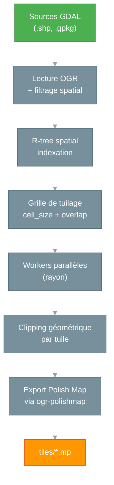

# mpforge — Le Forgeron de tuiles

## Le problème : des données massives à découper

La BD TOPO IGN représente environ **40 Go** de données pour la moitié sud de la France (régions Nouvelle-Aquitaine, Auvergne-Rhône-Alpes, Provence-Alpes-Côte d'Azur, Corse et Occitanie), avec des dizaines de couches géographiques (routes, bâtiments, hydrographie, végétation...). Un GPS Garmin ne peut pas digérer un fichier Polish Map monolithique de cette taille. Il faut **découper** les données en tuiles spatiales — des morceaux géographiques gérables — puis les recombiner à la compilation.

Ce tuilage spatial est une opération complexe :

- Il faut découper les géométries aux frontières des tuiles
- Gérer le chevauchement (overlap) pour éviter les artefacts visuels
- Appliquer des règles de catégorisation (quel type Garmin pour quel objet ?)
- Traiter des millions de features en temps raisonnable

## La solution : `mpforge`

`mpforge` est un CLI Rust qui orchestre tout ce processus en une seule commande :

```bash
mpforge build --config france-bdtopo.yaml --jobs 8
```

En sortie : des centaines (voire des milliers) de fichiers `.mp`, chacun couvrant une portion du territoire, prêts à être compilés par `imgforge`.

## Architecture



### Ce qui se passe en interne

1. **Lecture** — `mpforge` ouvre toutes les sources GDAL déclarées dans la configuration
2. **Filtrage spatial** — Si configuré, les features sont pré-filtrées par une géométrie de référence (ex: communes)
3. **Indexation** — Les features sont indexées dans un R-tree spatial pour des requêtes rapides
4. **Grille** — Une grille régulière (configurable en degrés) est calculée sur l'emprise des données
5. **Parallélisation** — Chaque tuile est traitée par un worker indépendant (rayon)
6. **Clipping** — Les géométries sont découpées aux frontières de la tuile (avec overlap)
7. **Généralisation** — Lissage (Chaikin) et simplification (Douglas-Peucker) optionnels
8. **Export** — Le driver ogr-polishmap génère le fichier `.mp` avec le field mapping configuré

## CLI `mpforge`

### Commandes

| Commande | Description |
|----------|-------------|
| `mpforge build` | Exécute le pipeline de tuilage complet |
| `mpforge validate` | Valide la configuration sans exécuter le pipeline |

### Options de `mpforge build`

```bash
mpforge build --config <fichier.yaml> [options]
```

| Option | Description | Défaut |
|--------|-------------|--------|
| `--config <path>` | Fichier de configuration YAML (obligatoire) | - |
| `--input <path>` | Surcharge le chemin d'entrée défini dans la config | - |
| `--output <path>` | Surcharge le répertoire de sortie défini dans la config | - |
| `--jobs <N>` | Nombre de threads parallèles | `1` |
| `--report <path>` | Exporte un rapport JSON d'exécution | - |
| `--skip-existing` | Reprend un export interrompu en sautant les tuiles déjà générées | `false` |
| `--dry-run` | Mode prévisualisation : affiche ce qui serait exporté sans écrire | `false` |
| `--disable-profiles` | Bypasse le catalogue externe `generalize_profiles_path` (les `generalize:` inline restent actifs). Accepte aussi l'env var `MPFORGE_PROFILES=off`. Voir [Profils multi-niveaux](#profils-multi-niveaux) | `false` |
| `--fail-fast` | Arrêt immédiat à la première erreur | `false` |
| `-v` / `-vv` / `-vvv` | Verbosité progressive (INFO / DEBUG / TRACE) | - |

!!! info "Lire les logs mpforge"
    Guide complet des messages de logs, niveaux de verbosité, filtrage `RUST_LOG` et format du rapport JSON : [Logs mpforge](../reference/logs-mpforge.md).

Exemples :

```bash
# Mode séquentiel (debug)
mpforge build --config config.yaml

# Mode production — 8 threads en parallèle
mpforge build --config config.yaml --jobs 8

# Reprendre un export interrompu
mpforge build --config config.yaml --jobs 8 --skip-existing

# Prévisualiser sans écrire (dry-run)
mpforge build --config config.yaml --dry-run

# Avec rapport JSON pour CI/CD
mpforge build --config config.yaml --jobs 8 --report report.json
```

### Options de `mpforge validate`

```bash
mpforge validate --config <fichier.yaml> [options]
```

| Option | Description | Défaut |
|--------|-------------|--------|
| `--config <path>` | Fichier de configuration YAML (obligatoire) | - |
| `--report <path>` | Exporte le résultat en JSON | - |
| `-v` / `-vv` / `-vvv` | Verbosité progressive | - |

Neuf vérifications sont effectuées :

| # | Check | Description |
|---|-------|-------------|
| 1 | `yaml_syntax` | Syntaxe YAML valide et types corrects |
| 2 | `semantic_validation` | Règles métier (grille, inputs, bbox, SRS, base_id, header, spatial_filter, generalize) |
| 3 | `input_files` | Existence des fichiers sources (après résolution des wildcards) |
| 4 | `rules_file` | Parsing et validation du fichier de règles |
| 5 | `field_mapping` | Parsing du fichier de field mapping |
| 6 | `header_template` | Existence du template header |
| 7 | `spatial_filter` | Existence des fichiers source de filtrage spatial (par input) |
| 8 | `generalize` | Rapport des configs de généralisation (smooth, iterations, simplify) |
| 9 | `label_case` | Cohérence label_case dans les règles (warning si aucune règle ne set Label) |

Exemple de sortie :

```
✓ yaml_syntax          — Parsed successfully
✓ semantic_validation  — All validations passed
✓ input_files          — 21/21 files found
✓ rules_file           — 22 rulesets, 283 rules total
- field_mapping        — Not configured
- header_template      — No template configured
✓ spatial_filter       — input #0: data/COMMUNE.shp
✓ generalize           — input #2: smooth=chaikin, iterations=1
✓ label_case           — 18 ruleset(s): Toponymie: Title, Communes: Title, ...

Config valid. (7/7 checks passed)
```

Code de sortie : `0` si valide, `1` si invalide. Le rapport JSON est exploitable en CI/CD.

### Parallélisation

`mpforge` utilise la bibliothèque **rayon** (Rust) pour distribuer le traitement sur N workers indépendants via l'option `--jobs`. Chaque worker ouvre ses propres datasets GDAL — aucun état partagé entre threads.

```bash
# Séquentiel (debug, pas de parallélisation)
mpforge build --config config.yaml --jobs 1

# 8 threads (production)
mpforge build --config config.yaml --jobs 8
```

| Dataset | `--jobs` recommandé | Speedup typique |
|---------|---------------------|----------------|
| < 50 tuiles | `1` (séquentiel) | - |
| 50-500 tuiles | `4` | ~2x |
| > 500 tuiles | `8` | ~2-3x |

!!! warning "Attention"
    Une valeur `--jobs` supérieure au nombre de CPUs disponibles est signalée par un warning et peut dégrader les performances.

### Gestion d'erreurs

Deux modes configurables dans le YAML (`error_handling`) ou en CLI (`--fail-fast`) :

- **`continue`** (défaut) — Les tuiles en erreur sont journalisées mais le traitement continue. Idéal pour la production où quelques tuiles problématiques ne doivent pas bloquer 2000 autres.
- **`fail-fast`** — Arrêt immédiat à la première erreur. Idéal pour le développement et le débogage.

### Rapport JSON

```json
{
  "status": "success",
  "tiles_generated": 2047,
  "tiles_failed": 0,
  "tiles_skipped": 150,
  "features_processed": 1234567,
  "skipped_additional_geom": 0,
  "duration_seconds": 1845.3,
  "errors": []
}
```

Le champ `skipped_additional_geom` compte les features qui ont été droppées parce qu'au moins un bucket `Data<n>=` additionnel a échoué à l'écriture (erreur FFI `OGR_F_SetGeomField` ≠ NONE, ou WKT invalide). Il n'apparaît pas quand la valeur est `0` (mode mono-Data). Voir [Profils multi-niveaux](#profils-multi-niveaux).

## Profils multi-niveaux

`mpforge` peut produire des `.mp` **multi-Data** : chaque feature transporte plusieurs géométries (`Data0=` détaillée, `Data2=` simplifiée pour zoom moyen, etc.), sélectionnées par `imgforge` selon le niveau de zoom. Deux mécanismes coexistent :

1. **Inline** dans `sources.yaml` via `generalize:` — produit une géométrie mono-niveau (`n=0`).
2. **Catalogue externe** `generalize_profiles_path: "./generalize-profiles.yaml"` — profils multi-level par type BDTOPO, avec dispatch par attribut (ex. `CL_ADMIN` pour `TRONCON_DE_ROUTE`) et bornes fail-fast au chargement (`iterations ∈ [0, 5]`, `simplify ∈ [0, 0.001]`).

Sémantique de `n` : index dans `MpHeader.levels` (0 = le plus détaillé, émis en `Data0=`). Le driver `ogr-polishmap` sérialise chaque bucket sur une ligne `Data<n>=` distincte.

Voir [Étape 2 — Configuration](../le-pipeline/etape-2-configuration.md#généralisation-de-géométrie) pour le schéma complet du catalogue et les exemples. La référence détaillée du catalogue est disponible dans [Profils de généralisation](../reference/generalize-profiles.md).

**Contraintes fail-fast** au `load_config` :

- Toute couche routable (`TRONCON_DE_ROUTE`) doit déclarer `n: 0` dans **chaque** branche visible (default + chaque `when`) — le routing exige un `Data0=` pour construire le graphe NET/NOD.
- Conflit inline/externe sur le même `source_layer` rejeté.
- `max(n)` sur tous les profils doit être `< header.levels.len()` — sinon `imgforge` drop silencieusement les `DataN` hors plage.

**Opt-out** : `mpforge build --disable-profiles` bypasse uniquement le catalogue externe (l'inline reste actif).

## Configuration YAML

`mpforge` utilise un fichier YAML déclaratif pour définir l'intégralité du pipeline. Ce fichier se compose de deux parties distinctes :

1. **Le fichier de configuration des sources** — Définit les inputs, la grille, l'output, le header et les options de traitement
2. **Le fichier de règles Garmin** — Définit les transformations d'attributs (types, labels, niveaux de zoom)

Le fichier de règles est référencé par le fichier de configuration via la directive `rules:`.

### Fichier de configuration des sources

Voici la structure complète, basée sur le fichier de production `sources.yaml` :

```yaml
version: 1

grid:
  cell_size: 0.15       # ~16.5 km par tuile (recommandé pour mkgmap/Garmin)
  overlap: 0.005        # Léger chevauchement pour éviter les artefacts aux bords

inputs:
  # Source simple avec reprojection
  - path: "${DATA_ROOT}/TRANSPORT/TRONCON_DE_ROUTE.shp"
    source_srs: "EPSG:2154"
    target_srs: "EPSG:4326"

  # Source avec généralisation géométrique
  - path: "${DATA_ROOT}/LIEUX_NOMMES/ZONE_D_HABITATION.shp"
    source_srs: "EPSG:2154"
    target_srs: "EPSG:4326"
    generalize:
      smooth: "chaikin"
      iterations: 1
      simplify: 0.00003

  # Wildcards + filtrage spatial + filtre attributaire
  - path: "${CONTOURS_DATA_ROOT}/**/COURBE_*.shp"
    source_srs: "EPSG:2154"
    target_srs: "EPSG:4326"
    attribute_filter: "CAST(ALTITUDE AS INTEGER) = (CAST(ALTITUDE AS INTEGER) / 10) * 10"
    layer_alias: "COURBE"
    spatial_filter:
      source: "${DATA_ROOT}/ADMINISTRATIF/COMMUNE.shp"
      buffer: 500  # mètres, dans le SRS source (EPSG:2154)

output:
  directory: "${OUTPUT_DIR}/mp/"
  filename_pattern: "BDTOPO-{col:03}-{row:03}.mp"
  overwrite: true
  base_id: ${BASE_ID}

header:
  name: "BDTOPO-{col:03}-{row:03}"
  copyright: "2026 Allfab Studio - IGN BDTOPO 2025"
  levels: "5"
  level0: "24"
  level1: "22"
  level2: "20"
  level3: "18"
  level4: "16"
  simplify_level: "0"
  tree_size: "1000"
  rgn_limit: "1024"
  lbl_coding: "9"
  routing: "Y"

# Référence vers le fichier de règles Garmin
rules: pipeline/configs/ign-bdtopo/departement/garmin-rules.yaml

error_handling: "continue"

# Filtre bbox (WGS84) — optionnel
# filters:
#   bbox: [5.0, 44.6, 6.4, 45.9]
```

#### Directives par source (`inputs`)

Chaque entrée `inputs` peut contenir :

| Directive | Description | Obligatoire |
|-----------|-------------|-------------|
| `path` | Chemin vers le fichier source (supporte les wildcards `*`, `**`) | oui* |
| `connection` | Chaîne de connexion PostGIS (non implémenté) | oui* |
| `source_srs` | SRS des données source (ex: `"EPSG:2154"`) | non |
| `target_srs` | SRS cible pour la reprojection (ex: `"EPSG:4326"`) | non |
| `layers` | Liste de couches à lire (pour GeoPackage multi-couches) | non |
| `layer_alias` | Nom de couche forcé (pour le matching des règles) | non |
| `attribute_filter` | Filtre SQL sur les attributs (clause WHERE OGR) | non |
| `generalize` | Configuration de généralisation géométrique (voir ci-dessous) | non |
| `spatial_filter` | Configuration de filtrage spatial (voir ci-dessous) | non |

\* `path` ou `connection`, l'un des deux est obligatoire (pas les deux).

#### Filtrage spatial (`spatial_filter`)

Pour les sources volumineuses (courbes de niveau, MNT...), `mpforge` permet de **filtrer spatialement les features** par une géométrie de référence avant le tuilage. Cela réduit drastiquement le volume de données traitées.

```yaml
inputs:
  - path: "${CONTOURS_DATA_ROOT}/**/COURBE_*.shp"
    source_srs: "EPSG:2154"
    target_srs: "EPSG:4326"
    spatial_filter:
      source: "${DATA_ROOT}/ADMINISTRATIF/COMMUNE.shp"  # Géométrie de référence
      buffer: 500                                         # Buffer en mètres (SRS source)
```

| Option | Description | Défaut |
|--------|-------------|--------|
| `source` | Chemin vers le shapefile de référence (obligatoire) | - |
| `buffer` | Distance de buffer en mètres, dans le SRS source | `0.0` |

Le filtre fonctionne par union binaire (O(n log n)) des géométries de référence, avec pré-rejet par enveloppe pour optimiser les performances. Seules les features intersectant la géométrie résultante (avec buffer) sont conservées.

#### Généralisation géométrique (`generalize`)

`mpforge` intègre un pipeline de généralisation appliqué après le clipping et avant l'export. La directive `generalize` est un bloc imbriqué dans chaque source :

```yaml
inputs:
  - path: "${DATA_ROOT}/LIEUX_NOMMES/ZONE_D_HABITATION.shp"
    source_srs: "EPSG:2154"
    target_srs: "EPSG:4326"
    generalize:
      smooth: "chaikin"       # Lissage Chaikin (corner-cutting)
      iterations: 1           # Nombre de passes de lissage
      simplify: 0.00003       # Tolérance Douglas-Peucker (en degrés)
```

| Option | Description | Défaut |
|--------|-------------|--------|
| `smooth` | Algorithme de lissage (seul `"chaikin"` est supporté) | - |
| `iterations` | Nombre de passes de lissage (minimum 1) | `1` |
| `simplify` | Tolérance Douglas-Peucker post-lissage (en degrés) | - |

!!! tip "Impact en production"
    Sur les données BD TOPO (~35 Go), limitez les itérations à 1 pour éviter une consommation mémoire excessive. La simplification Douglas-Peucker est optionnelle et s'applique après le lissage.

#### Variables d'environnement

Les fichiers de configuration supportent les **variables d'environnement** avec la syntaxe `${VAR}`. Elles sont substituées avant le parsing YAML :

```yaml
inputs:
  - path: "${DATA_ROOT}/TRANSPORT/TRONCON_DE_ROUTE.shp"

output:
  directory: "${OUTPUT_DIR}/tiles/"
  base_id: ${BASE_ID}   # Fonctionne aussi pour les champs numériques
```

```bash
# Les variables sont résolues au lancement
DATA_ROOT=/data/bdtopo OUTPUT_DIR=/output BASE_ID=38 \
  mpforge build --config config.yaml --jobs 8
```

Seuls les noms de variables POSIX valides sont reconnus (`[A-Za-z_][A-Za-z0-9_]*`). Les variables non définies sont laissées telles quelles — `mpforge validate` les signale comme warnings.

#### Field mapping

Les données BD TOPO utilisent des noms de champs comme `MP_TYPE`, `NAME`, `MPBITLEVEL`. Le format Polish Map attend `Type`, `Label`, `Levels`. Le field mapping fait le pont :

```yaml
# bdtopo-mapping.yaml
field_mapping:
  MP_TYPE: Type          # Code type Garmin
  NAME: Label            # Nom de l'objet
  Country: CountryName   # Pays
  CityName: CityName     # Commune
  MPBITLEVEL: Levels     # Niveaux de zoom
```

Cette séparation en deux fichiers (config + mapping) permet de **réutiliser** le même mapping pour plusieurs configurations.

#### Header template

Chaque tuile `.mp` a besoin d'un header avec des métadonnées (nom, copyright, niveaux de zoom). Le header peut être défini directement dans le YAML ou via un template externe :

```yaml
# Directement dans le YAML
header:
  name: "BDTOPO-{col:03}-{row:03}"
  copyright: "2026 Allfab Studio"
  levels: "5"
  level0: "24"
  level1: "22"
  level2: "20"

# OU via un template externe
header:
  template: "header_template.mp"
```

### Fichier de règles Garmin

Le fichier de règles (`garmin-rules.yaml`) est un fichier YAML séparé, référencé dans la configuration via `rules:`. Il définit comment les attributs des features sources sont transformés en attributs Polish Map (types Garmin, labels, niveaux de zoom).

#### Structure

```yaml
version: 1

rulesets:
  - name: "Routes"
    source_layer: "TRONCON_DE_ROUTE"
    rules:
      - match:
          CL_ADMIN: "Autoroute"
        set:
          Type: "0x01"
          EndLevel: "2"
          Label: "~[0x04]${NUMERO}"

      - match:
          CL_ADMIN: "Nationale"
          NATURE: "!Rond-point"
        set:
          Type: "0x04"
          EndLevel: "2"
          Label: "~[0x05]${NUMERO}"
```

Chaque **ruleset** cible une couche source (`source_layer`) et contient une liste de **règles** évaluées en **first-match-wins** : la première règle dont toutes les conditions `match` sont satisfaites est appliquée.

#### Opérateurs de matching

| Opérateur | Syntaxe | Description |
|-----------|---------|-------------|
| Égalité stricte | `"Autoroute"` | Valeur exacte |
| Wildcard | `"*"` | Toujours vrai |
| Non vide | `"!!"` | Le champ existe et n'est pas vide |
| Vide | `""` | Le champ est absent ou vide |
| In-list | `"in:val1,val2,val3"` | Appartenance à une liste |
| Not-in-list | `"!in:val1,val2"` | Exclusion d'une liste |
| Starts-with | `"^prefix"` | Le champ commence par `prefix` |
| Starts-with (insensible) | `"^i:prefix"` | Idem, insensible à la casse |
| Not-starts-with | `"!^prefix"` | Le champ ne commence pas par `prefix` |
| Not-equal | `"!valeur"` | Différent de `valeur` |

#### Substitution de champs

Dans les valeurs `set`, la syntaxe `${FIELD}` substitue la valeur de l'attribut source :

```yaml
set:
  Label: "~[0x04]${NUMERO}"   # → "~[0x04]A7"
  Label: "${TOPONYME}"          # → "Mont Blanc"
```

#### Formatage de casse des labels (`label_case`)

L'option `label_case` contrôle la casse des labels écrits dans les fichiers MP. Elle peut être définie au niveau du **ruleset** (défaut pour toutes les règles) ou au niveau d'une **règle individuelle** (override du ruleset).

| Valeur | Description | Exemple |
|--------|-------------|---------|
| `none` | Pas de changement (défaut) | `"Mont Blanc"` → `"Mont Blanc"` |
| `upper` | Tout en majuscules | `"Mont Blanc"` → `"MONT BLANC"` |
| `lower` | Tout en minuscules | `"Mont Blanc"` → `"mont blanc"` |
| `title` | Casse de titre | `"mont blanc"` → `"Mont Blanc"` |
| `capitalize` | Première lettre en majuscule | `"mont blanc"` → `"Mont blanc"` |

Les préfixes Garmin (`~[0xNN]`) sont préservés : seule la partie texte est transformée.

```yaml
- name: "Toponymie"
  source_layer: "TOPONYMIE"
  label_case: "title"        # Défaut pour tout le ruleset
  rules:
    - match:
        CLASSE: "Montagne"
      set:
        Type: "0x6616"
        Label: "${GRAPHIE}"
      label_case: "upper"    # Override : sommets en majuscules
```

## Sources supportées

`mpforge` lit **tous les formats fichier GDAL/OGR** :

| Format | Type | Exemple |
|--------|------|---------|
| ESRI Shapefile | Fichier | `data/routes.shp` |
| GeoPackage | Fichier | `data/bdtopo.gpkg` |
| GeoJSON | Fichier | `data/features.geojson` |
| KML/KMZ | Fichier | `data/map.kml` |

!!! note "PostGIS"
    Les chaînes de connexion PostGIS sont reconnues par le parseur de configuration, mais la lecture effective des données n'est pas encore implémentée dans le pipeline. Prévu dans une future version.

## Installation

### Binaire pré-compilé (recommandé)

Le binaire statique inclut **PROJ 9.3.1, GEOS 3.13.0, GDAL 3.10.1 et le driver ogr-polishmap intégrés**. Zéro configuration requise :

```bash
# Télécharger et extraire l'archive
wget https://github.com/allfab/garmin-img-forge/releases/download/mpforge-v0.5.0/mpforge-linux-amd64.tar.gz
tar xzf mpforge-linux-amd64.tar.gz

chmod +x mpforge
sudo mv mpforge /usr/local/bin/
mpforge --version
```

!!! info "Comprendre la sortie `--version`"
    Les suffixes `-N-g<hash>` et `-dirty` ont un sens précis — voir la page [Versioning des binaires](../reference/versioning-binaires.md) pour la lecture complète de la version et le workflow de release.

### Compilation depuis les sources

```bash
# Prérequis : Rust 1.70+ et GDAL 3.0+
cd tools/mpforge
cargo build --release
```
