# Le format Garmin IMG — Architecture et fonctionnement

Cette page explique de manière pédagogique l'architecture interne du format Garmin IMG — le format binaire dans lequel toutes les cartes Garmin sont stockées. Elle s'appuie sur les spécifications publiques (*imgformat-0.5* de John Mechalas, 2005), les sources de mkgmap r4924, le décompilateur imgdecode-1.1, et le code source d'imgforge.

<div style="display:flex;gap:1rem;align-items:center;margin-bottom:1rem">
  <a href="../../../assets/resources/garmin-img-format-reference-fr.pdf" class="md-button md-button--primary" download>
    :material-file-pdf-box: Télécharger le document de référence PDF
  </a>
  <span style="font-size:.85em;color:var(--md-default-fg-color--light)">Version complète avec toutes les structures binaires, enrichie des découvertes du projet.</span>
</div>

---

## Vue d'ensemble

Un fichier `.img` Garmin n'est **pas** une image au sens habituel. C'est un **système de fichiers miniature** — proche d'une disquette DOS — qui contient plusieurs sous-fichiers encodés en little-endian. Chacun joue un rôle précis dans le rendu, le routage ou les métadonnées.

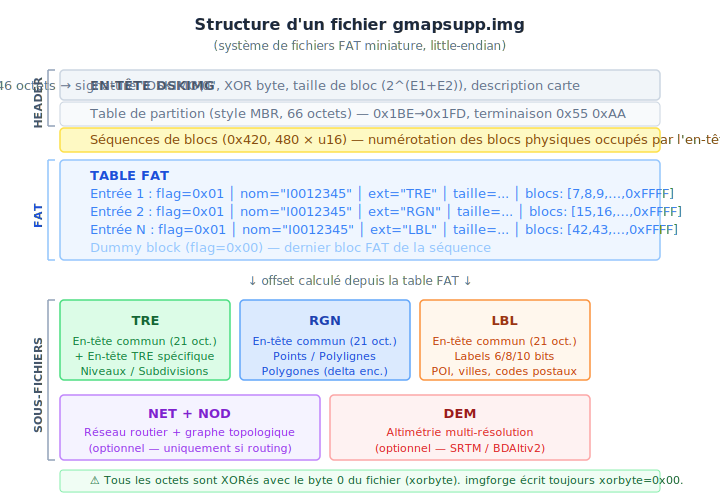

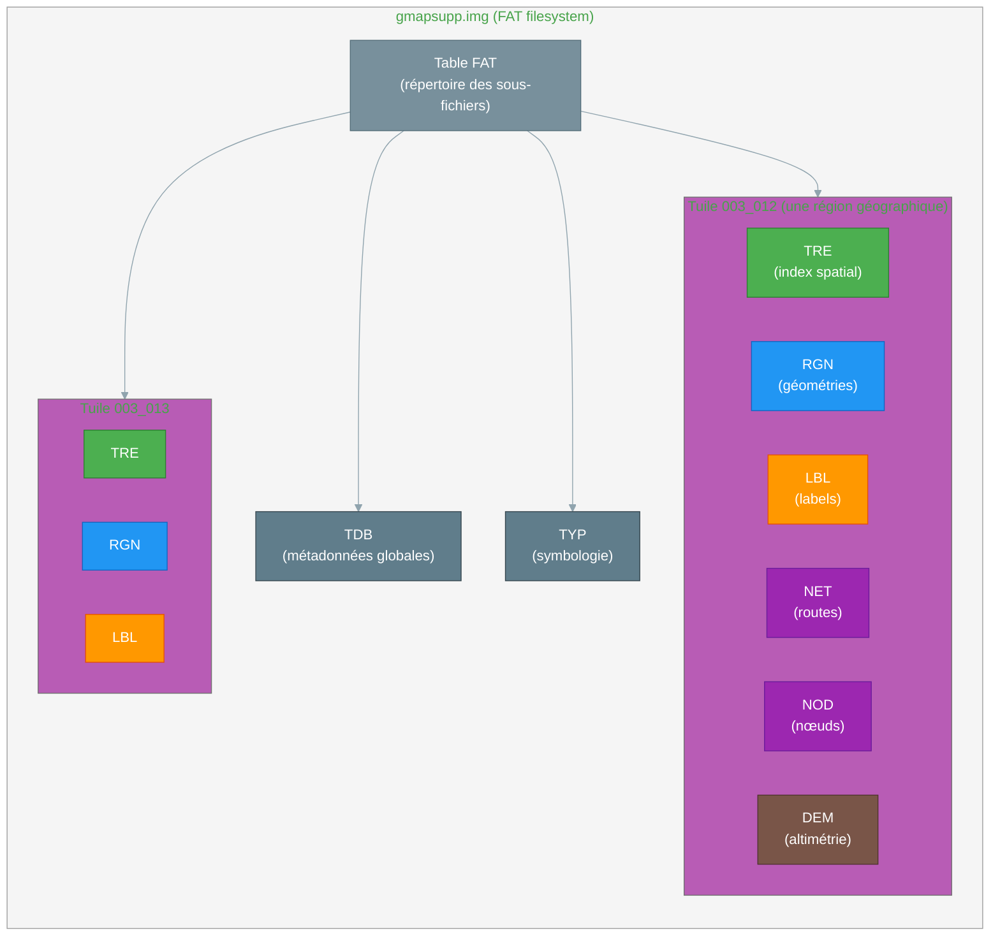

!!! note "XOR byte — obfuscation, pas du chiffrement"
    Tous les octets du conteneur sont XORés avec l'`xorbyte` (octet 0 du fichier) à la lecture/écriture. La clé étant **stockée dans le fichier lui-même**, l'opération est trivialement réversible — c'est de l'obfuscation, pas du chiffrement. Les maps communautaires (imgforge, mkgmap) écrivent toujours `xorbyte = 0x00`. Les maps commerciales Garmin utilisent parfois une valeur non nulle, mais sans apporter de sécurité réelle à ce niveau.

---

## En-tête DSKIMG

L'en-tête occupe les 512 premiers octets et décrit la géométrie du "disque" (taille de bloc, signatures, métadonnées de la carte). Sa structure rappelle volontairement un Master Boot Record DOS.

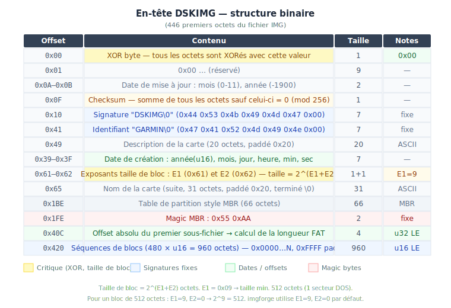

La **taille de bloc** `2^(E1+E2)` est déterminante : elle définit la granularité de toutes les adresses dans la table FAT. imgforge utilise E1=9, E2=0 → blocs de 512 octets par défaut. Des blocs plus grands (1024, 2048 octets) permettent des fichiers IMG de plus grande capacité.

---

## Format des sous-fichiers

Chaque sous-fichier (TRE, RGN, LBL, NET, NOD, DEM) commence par un **en-tête commun de 21 octets** identique — défini dans mkgmap `CommonHeader.java` et reproduit dans `imgforge/src/img/common_header.rs`.

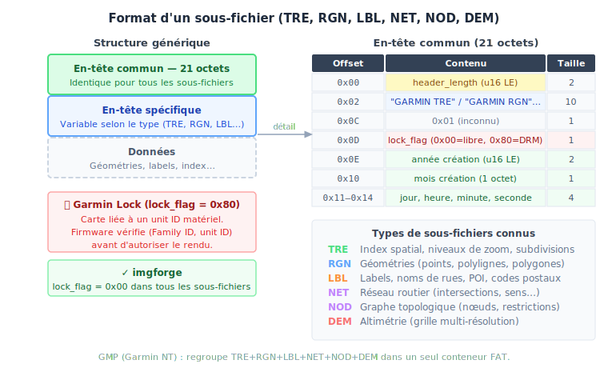

### Le `lock_flag` et le système Garmin Lock

C'est ici que réside la **vraie protection DRM** des cartes commerciales Garmin (City Navigator, TOPO France...), distincte du XOR byte du conteneur.

Quand `lock_flag = 0x80`, le firmware Garmin exige un **code de déverrouillage** lié à l'identifiant matériel de l'appareil (`unit ID`). La carte est achetée pour un appareil précis — au démarrage, le firmware vérifie le couple `(Family ID de la carte, unit ID du GPS)` avant d'autoriser l'affichage. Sans code valide, la carte apparaît dans les menus mais reste invisible à l'écran. C'est ce que MapInstall et myGarmin gèrent lors de l'achat de cartes payantes.

**Pour nos cartes (imgforge) :** `lock_flag = 0x00` dans tous les sous-fichiers — déverrouillées par définition, cohérent avec la nature libre des données IGN BDTOPO.

---

## Coordonnées Garmin (unités de carte)

Le GPS Garmin utilise un système de coordonnées propre, non les degrés décimaux directs. Les coordonnées sont encodées en **entiers 32 bits signés** selon la formule :

```
coord_garmin = round(coord_degrés × 2^(bits - 1) / 180)
```

Pour une carte à 24 bits de résolution (niveau le plus détaillé) :

```
1 unité = 180 / 2^23 ≈ 0.0000214 degrés ≈ 2.4 mètres à l'équateur
```

| Résolution (bits) | Précision approx. | Usage |
|-------------------|-------------------|-------|
| 24 | ~2 m | Zoom maximum, détail GPS |
| 23 | ~5 m | Palier intermédiaire (header 7L) |
| 22 | ~9 m | Zoom quartier |
| 21 | ~19 m | Palier intermédiaire (header 7L) |
| 20 | ~37 m | Zoom ville |
| 18 | ~150 m | Zoom régional |
| 16 | ~600 m | Zoom national |

Les niveaux dans le header Polish Map (`level0: "24"`, `level1: "23"`...) correspondent directement à ces valeurs de bits. imgforge utilise le header 7 niveaux **24/23/22/21/20/18/16** pour tous les scopes de production.

---

## Subdivision : l'unité de base du rendu

Le concept central du format IMG est la **subdivision** (subdivision TRE/RGN). C'est la cellule élémentaire du découpage spatial — chaque tuile contient une hiérarchie de subdivisions imbriquées.

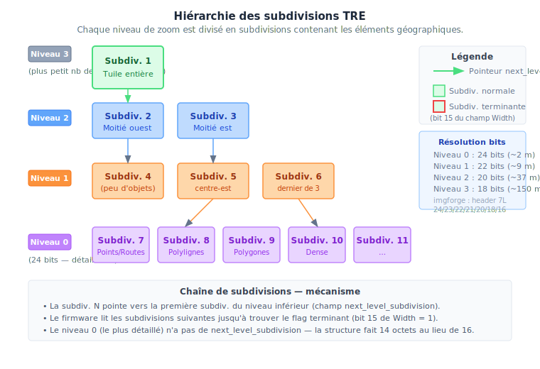

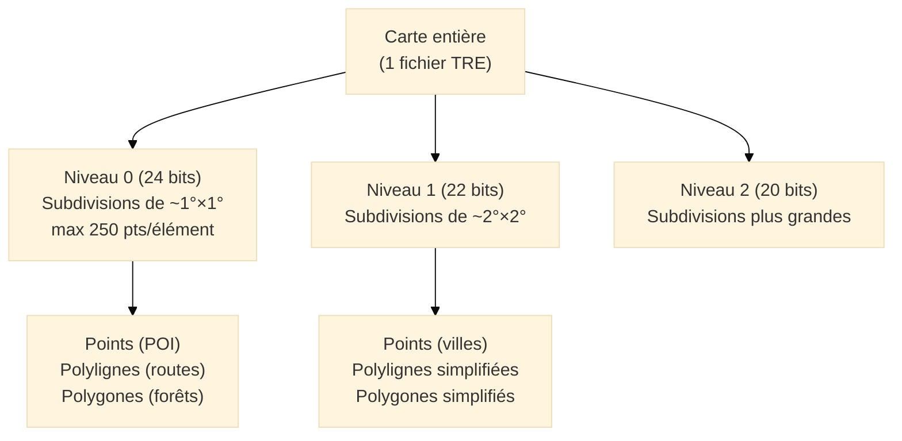

Chaque subdivision est une zone rectangulaire (bounding box + centre) contenant des pointeurs vers les éléments géographiques dans le RGN pour un niveau de zoom donné. Le firmware Garmin sélectionne les subdivisions visibles à l'écran et les affiche — c'est le moteur de rendu "tuilé interne".

**Structure d'une subdivision** (16 octets pour les niveaux non-feuille, 14 pour le niveau 0) :

| Champ | Taille | Description |
|-------|--------|-------------|
| `rgn_data_ptr` | 3 | Offset dans le fichier RGN |
| `obj_types` | 1 | Masque de types présents (0x10=pts, 0x20=pts indexés, 0x40=polylignes, 0x80=polygones) |
| `longitude_center` | 3 | Longitude du centre (unités Garmin) |
| `latitude_center` | 3 | Latitude du centre |
| `width` | 2 | Largeur + bit 15 = flag terminant de chaîne |
| `height` | 2 | Hauteur (unités Garmin) |
| `next_level_subdivision` | 2 | Index de la première subdiv. du niveau inférieur *(absent au niveau 0)* |

---

## TRE — Index spatial

Le sous-fichier **TRE** (*Tree data*) est le cerveau d'une tuile. Il contient :

1. **L'en-tête de la carte** — bounding box, niveaux de zoom, routing flag
2. **La table des subdivisions** — la liste de toutes les subdivisions avec leur bounding box et leurs offsets dans le RGN
3. **Les sections overview** — pour les tuiles participant à une carte multi-tuiles

```
En-tête commun (21 octets)
  + header_length spécifique TRE (188 octets en mode standard)

Bounding box de la tuile :
  max_lat  (24 bits, 3 octets)
  max_lon  (24 bits, 3 octets)
  min_lat  (24 bits, 3 octets)
  min_lon  (24 bits, 3 octets)

Niveaux de zoom :
  levels_count (1 octet)       — nombre de niveaux
  Level0_bits  (1 octet)       — résolution niveau 0 (ex: 24)
  Level1_bits  (1 octet)       — résolution niveau 1 (ex: 23)
  ...

Pointeurs sections :
  map_levels_offset / map_levels_size     (niveaux de zoom)
  subdivisions_offset / subdivisions_size (liste des subdivisions)
  polylines_defn_offset / ...             (définitions de types)
  polygons_defn_offset / ...
  points_defn_offset / ...
```

### Niveaux overview (TRE overview section)

Pour les tuiles qui participent à une carte multi-tuiles, le TRE contient aussi une **section overview** avec les données des niveaux de zoom larges (niveaux 7-9 dans le header 7L+). Cette section permet au firmware d'afficher des frontières et routes simplifiées avant d'avoir chargé les tuiles détaillées.

!!! note "Historique du bug Alpha 100 wide-zoom"
    Un bug critique (corrigé en `7e68d62`) fixait `max_level=0` en dur dans la section overview TRE, rendant les niveaux de zoom larges invisibles sur l'Alpha 100. La valeur correcte doit être `max_level = levels_count - 1`.

---

## RGN — Géométries

Le sous-fichier **RGN** (*Region data*) contient toutes les géométries encodées en delta variable-width.

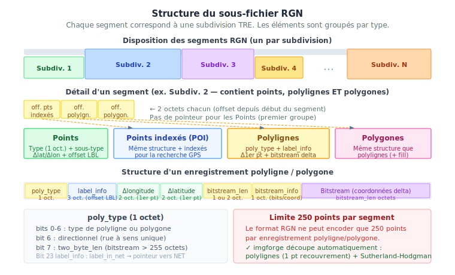

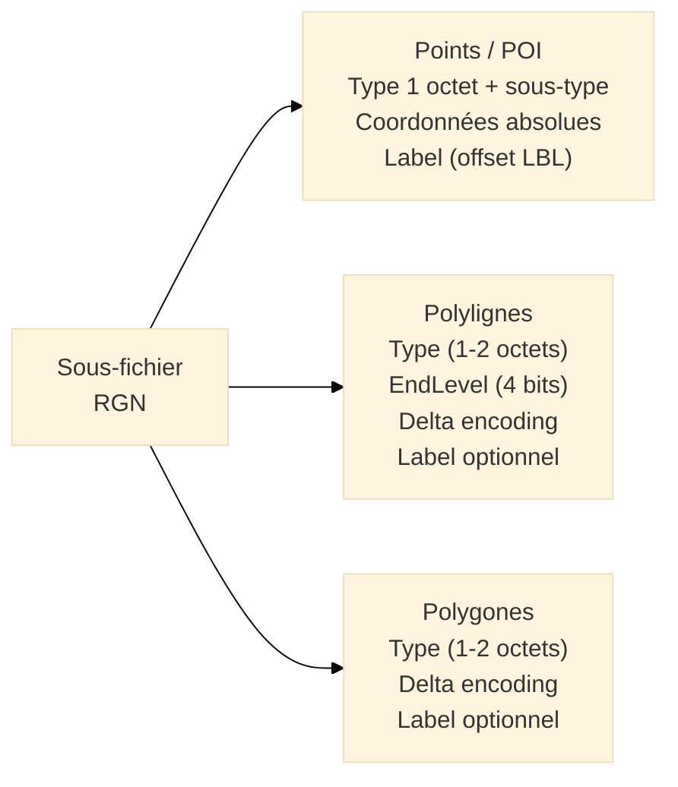

### Encodage delta bitstream

Les coordonnées ne sont **pas** stockées en valeurs absolues mais en **différences successives** (deltas). Cela réduit la taille des fichiers de 30 à 50 % :

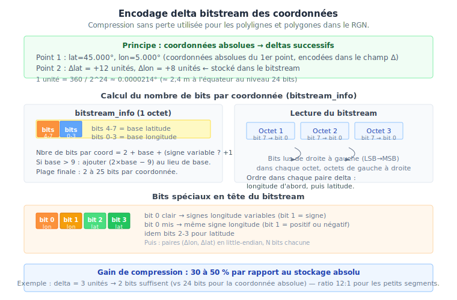

### Limite de 250 points

Le format RGN impose une limite de **250 points** par segment de polyligne/polygone. imgforge découpe automatiquement les features dépassant cette limite :

- **Polylignes** : segmentées avec 1 point de recouvrement aux jointures
- **Polygones** : découpés par clipping Sutherland-Hodgman récursif

---

## LBL — Labels

Le sous-fichier **LBL** (*Label data*) contient tous les noms (rues, villes, POI...) dans un format compact.

### Trois encodages supportés

| Format | Encodage | Bits par caractère | Option imgforge |
|--------|-----------|--------------------|-----------------|
| **Format 6** | ASCII 6 bits réduit | 6 bits | défaut |
| **Format 9** | Code page Windows (CP1252, CP1250...) | 8 bits | `--latin1` |
| **Format 10** | UTF-8 | variable | `--unicode` |

Format 6 est le plus compact mais ne supporte que les caractères `A-Z`, `0-9` et l'espace. Pour les cartes françaises, **Format 9 avec CP1252** est recommandé : il couvre tous les accents français tout en restant compact.

Les labels sont stockés bout-à-bout avec un octet `0x00` comme séparateur. Les polylignes et polygones référencent leur label par un **offset** dans cette section (multiplié par le `label_multiplier` si > 0).

---

## NET et NOD — Routage

Les sous-fichiers **NET** et **NOD** implémentent la topologie routière pour la navigation turn-by-turn.

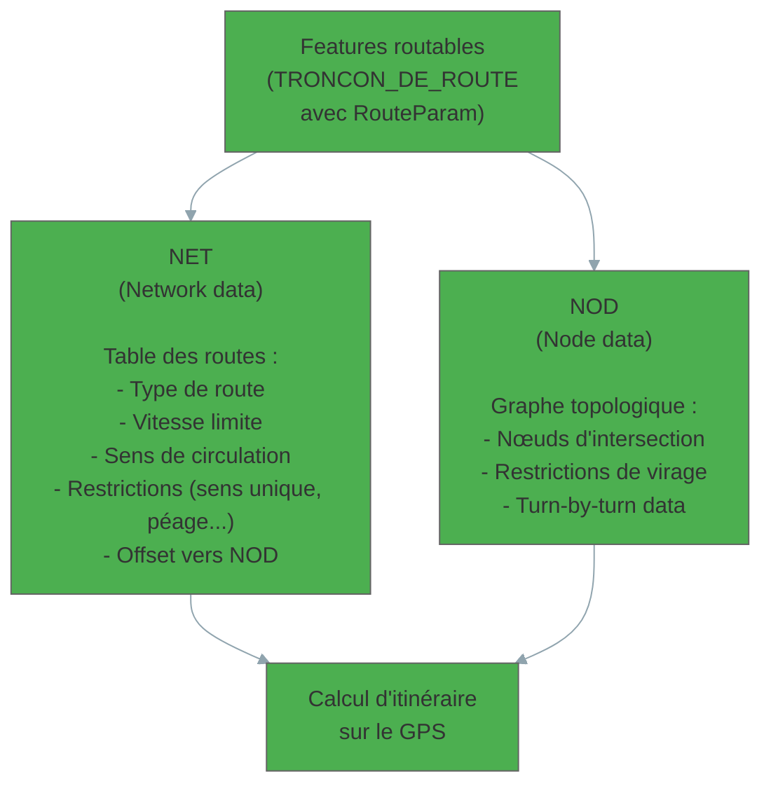

!!! danger "Routage expérimental dans imgforge"
    Le réseau routier généré par imgforge est **indicatif uniquement**. Le graphe NET/NOD est construit à partir des attributs BDTOPO (`VITESSE_MOYENNE_VL`, `ACCES_VL`, sens de circulation) mais la couverture des restrictions complexes (giratoires, accès réglementés) est partielle.

---

## DEM — Altimétrie

Le sous-fichier **DEM** stocke les données d'élévation utilisées pour l'ombrage du relief (hillshading) et les profils d'altitude sur le GPS.

```
En-tête DEM :
  bounding_box   (lat/lon min/max)
  zoom_levels    (nombre de niveaux)
  base_bits      (précision de base)

Pour chaque niveau de zoom :
  Section-header (60 octets) :
    distance     (espacement entre points, en unités carte)
    rows × cols  (dimensions de la grille)
    data_offset  (offset +32 dans le section-header)
    data_offset2 (offset +36)
  elevations[]   (delta-encodés, signés, en mètres)
```

imgforge lit les fichiers **HGT** (SRTM NASA, format 1/3 arc-seconde) et **ASC** (ESRI ASCII Grid — BDAltiv2 IGN), les reprojette en WGS84 si nécessaire, et génère la grille DEM multi-résolution.

Le paramètre `--dem-dists` contrôle l'espacement entre points d'élévation par niveau de zoom. Un espacement plus grand réduit la taille du fichier mais dégrade la précision du relief à faible zoom.

!!! warning "Bug DEM dans le GmpWriter"
    Les offsets `data_offset`/`data_offset2` dans les section-headers DEM sont à `+32` et `+36` — et **non** `+20` et `+24` comme codé initialement. L'erreur déclenchait une allocation mémoire de ~1290 descripteurs DEM au boot Alpha 100. Corrigé dans `relocate_dem`.

---

## TDB — Métadonnées globales

Le sous-fichier **TDB** (*Topo Data Block*) est unique dans un `gmapsupp.img`. Il contient les métadonnées de l'ensemble de la carte, utilisées par les logiciels PC (BaseCamp, MapInstall) :

```
Family ID     (u16)  — identifiant unique de la famille de cartes
Product ID    (u16)  — identifiant produit
Family name         — "BDTOPO France"
Series name         — "IGN BDTOPO 2026"
Country, Region     — pour le catalogue BaseCamp
Bounding boxes      — liste des tuiles avec leur emprise
Copyright           — message légal
```

---

## TYP — Symbologie personnalisée

Le fichier **TYP** n'est pas lié à une tuile spécifique : c'est un dictionnaire de symboles (couleurs, motifs de remplissage, icônes) qui remplace la symbologie par défaut du firmware pour les types Garmin utilisés dans la carte.

```
Section [_id]      — identifiant famille (doit correspondre au Family ID du TDB)
Section [Type0xNN] — définition d'un type polyligne
  String1=Route principale
  Color=0xRRGGBB
  Width=3
Section [Type0xNN P]  — définition d'un type polygone
Section [Type0xNN E]  — définition d'un type POI
```

!!! warning "Encodage CP1252"
    Le fichier TYP de ce projet (`I2023100.typ`) est généré par TYPViewer en **Windows-1252**. `imgforge typ compile --encoding cp1252` ou la détection automatique (`auto`) gèrent correctement ce fichier.

---

## GMP — Format Garmin NT consolidé

Le format **GMP** (*Garmin Map Product*) est une variante moderne qui regroupe les sous-fichiers d'une tuile dans un **unique fichier FAT** — supprimant 83 % des entrées FAT pour une carte France entière.

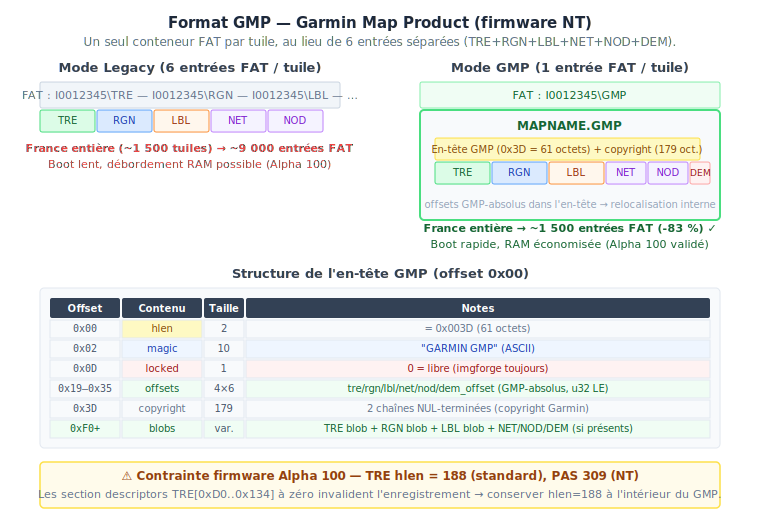

### Écueils d'implémentation — firmware Alpha 100

L'implémentation du `GmpWriter` a nécessité 5 cycles de test hardware (GC1-GC5) pour identifier les contraintes non documentées du firmware Alpha 100 :

| Écueil | Symptôme sur Alpha 100 | Cause | Fix retenu |
|--------|----------------------|-------|-----------|
| **Extension NT du TRE** (`hlen=309`) | Tuile invisible | Section descriptors TRE[0xD0..0x134] à zéro invalident l'enregistrement | Conserver `hlen=188` (TRE standard) à l'intérieur du GMP |
| **`tre10_rec_size = 0`** | Crash firmware | `count = size / rec_size` avec `rec_size=0` → division par zéro | Inclus dans le fix `hlen=188` |
| **`relocate_dem` — mauvaises positions** | GMP non reconnu avec DEM | `data_offset` à `+32/+36` mais code patchait `+20/+24` → firmware alloue ~1290 descripteurs | Corriger `base+20/24` → `base+32/36` dans `relocate_dem` |

!!! success "Validé en production sur Alpha 100"
    `--packaging gmp` est fonctionnel en production depuis avril 2026, validé sur firmware Alpha 100
    avec un build IGN BD TOPO D038 complet (données altimétrie BDAltiv2 incluses).

---

## Du Polish Map (.mp) au fichier IMG — le pipeline imgforge

Le format **Polish Map** (`.mp`) est le format texte intermédiaire entre mpforge et imgforge. Il décrit les features avec leur type Garmin, leurs coordonnées WGS84, et leurs métadonnées :

```
[IMG ID]
...
[POLYLINE]
Type=0x05          ; Type Garmin (route nationale)
EndLevel=2         ; Disparaît au zoom niveau 2
Label=RN7
RouteParam=3,0,0,0,0,0,0
Data0=(45.123,5.456),(45.127,5.461),(45.130,5.468)
Data2=(45.123,5.456),(45.130,5.468)      ; Géométrie simplifiée niveau 2
[END]
```

imgforge lit ces fichiers et effectue les transformations suivantes :

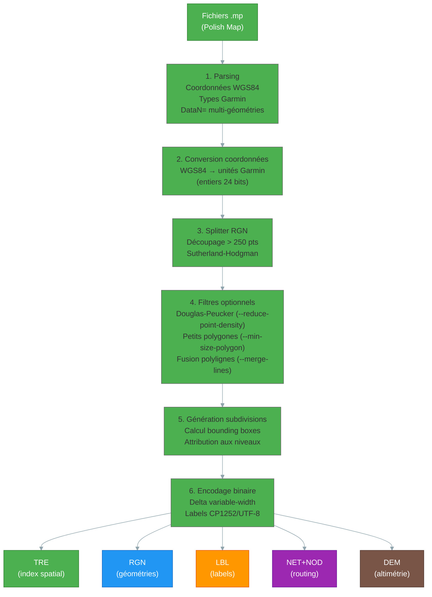

---

## Limites du format

| Limite | Valeur | Impact |
|--------|--------|--------|
| Points par segment polyligne/polygone | 250 | imgforge découpe automatiquement |
| Niveaux de zoom | 10 (max) | Header Polish Map 7L standard + 3 overview |
| Sous-fichiers par tuile | ≤ 6 (`legacy`) ou 1 (`gmp`) | NET/NOD absents sans routing, DEM absent sans `--dem` |
| Taille d'un label encodé | ~255 octets | Labels très longs tronqués |
| Précision coordonnées | 24 bits (~2 m) | Suffisant pour la cartographie routière/outdoor |
| Entrées FAT gmapsupp | Firmware-dépendant | Alpha 100 : plafond RAM au boot → préférer `cell_size` ≥ 0.30° ou mode GMP |

---

## Pour aller plus loin

| Ressource | Emplacement local | Contenu |
|-----------|-------------------|---------|
| Spécification imgformat-0.5 | `tmp/imgdecode-1.1/imgformat-0.5.pdf` | Structures TRE, RGN, LBL, NET (John Mechalas, 2005) |
| imgdecode-1.1 | `tmp/imgdecode-1.1/` | Décompilateur C++ de référence |
| mkgmap r4924 | `tmp/mkgmap/` | Implémentation Java de référence |
| imgforge | `tools/imgforge/src/img/` | Implémentation Rust (ce projet) |
| Document de référence PDF | `site/assets/resources/garmin-img-format-reference-fr.pdf` | Ce projet, version imprimable |
