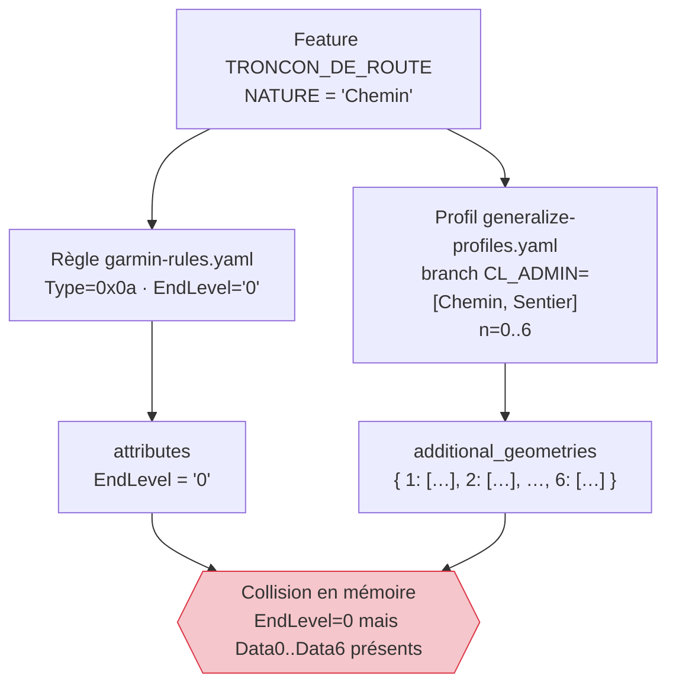
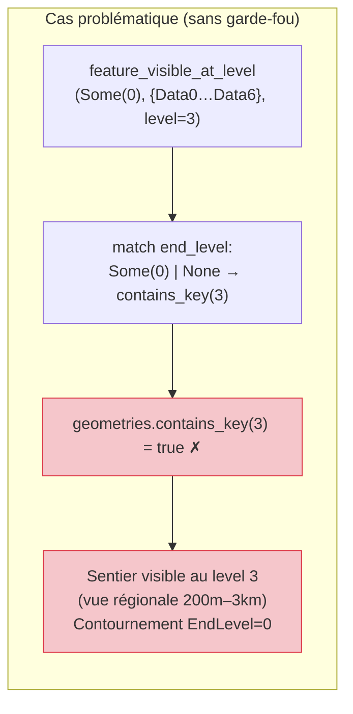
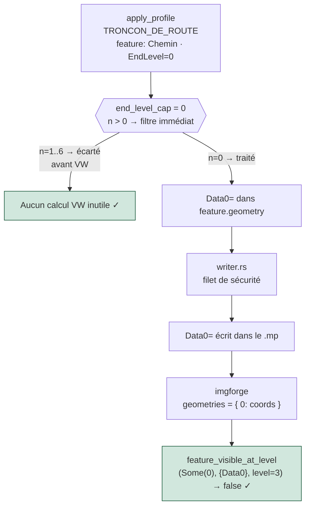
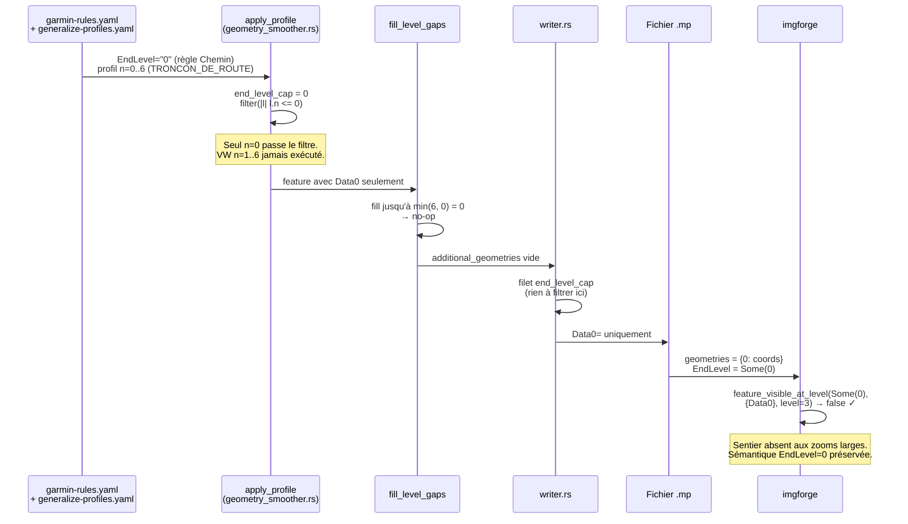

# Catalogue de profils de généralisation

Le fichier `generalize-profiles.yaml` est le catalogue central de **généralisation géométrique multi-niveaux** pour mpforge. Il déclare, pour chaque couche BDTOPO, comment simplifier et lisser les géométries à chaque niveau de zoom de la carte Garmin.

Ce fichier est référencé dans `sources.yaml` via la directive :

```yaml
generalize_profiles_path: "../generalize-profiles.yaml"
```

---

## Pourquoi un catalogue de profils ?

La directive `generalize:` inline dans `sources.yaml` produit une seule géométrie simplifiée (`Data0=`). Le catalogue de profils va plus loin : chaque feature transporte **plusieurs géométries** selon le zoom (`Data0=` détaillée, `Data2=` simplifiée, etc.), que `imgforge` sélectionne automatiquement à l'affichage.

```
Feature TRONCON_DE_ROUTE (autoroute)
  └── Data0=  géométrie VW conservatrice (zoom max)
  └── Data1=  VW moyen
  └── Data2=  VW fort
  └── Data3=  ...
  └── Data4=
  └── Data5=
  └── Data6=  VW très agressif (zoom minimal)
```

---

## Structure du fichier

```yaml
profiles:
  <SOURCE_LAYER>:          # Nom de couche GDAL (ex: TRONCON_DE_ROUTE)
    topology: true         # Optionnel — simplification topologique globale (absent = false)
    levels:                # Paliers simples (sans dispatch)
      - { n: 0, simplify: 0.00005 }
      - { n: 1, simplify: 0.00008 }
      ...
    when:                  # Dispatch conditionnel par attribut (optionnel)
      - field: CL_ADMIN
        values: [Autoroute, Nationale]
        levels:
          - { n: 0, simplify_vw: 0.000001 }
          ...
```

### Clés d'un niveau (`levels[]`)

| Clé | Type | Obligatoire | Description |
|-----|------|-------------|-------------|
| `n` | entier | oui | Index de niveau dans `MpHeader.levels` (0 = plus détaillé, 6 = plus grossier) |
| `simplify` | flottant | non | Tolérance Douglas-Peucker en degrés WGS84 |
| `simplify_vw` | flottant | non | Seuil d'aire triangulaire Visvalingam-Whyatt en unités WGS84² (aire du triangle formé par 3 points consécutifs — les points dont l'aire < seuil sont supprimés). Typiquement utilisé avec `topology: true`. |
| `smooth` | chaîne | non | Algorithme de lissage — seul `"chaikin"` est supporté |
| `iterations` | entier | non (si `smooth`) | Passes de lissage Chaikin (borne `[0, 5]`) |

!!! warning "Contraintes fail-fast"
    Au chargement de la config, mpforge valide :
    - `iterations ∈ [0, 5]`
    - `simplify ∈ [0, 0.001]` (≈ 0 à 110 m)
    - Toute couche routable (`TRONCON_DE_ROUTE`) doit déclarer `n: 0` dans **chaque** branche `when` (routing exige `Data0=` strict)
    - Un même `source_layer` ne peut pas apparaître à la fois en `generalize:` inline et dans le catalogue (conflit rejeté)
    - `max(n)` de tous les profils doit être `< header.levels.len()` (sinon `imgforge` drop silencieusement les `DataN` hors plage)

### Référence des tolérances

| Valeur | Équivalent métrique approx. | Usage typique |
|--------|---------------------------|---------------|
| `0.00002` | ~2 m | Zoom maximum (Data0) — très conservateur |
| `0.00005` | ~5 m | Zoom détaillé |
| `0.00010` | ~11 m | Zoom moyen |
| `0.00020` | ~22 m | Zoom régional |
| `0.00050` | ~55 m | Zoom national |
| `0.00100` | ~110 m | Zoom continental (borne max autorisée) |

---

## Contiguïté des paliers — règle critique

Les `n` déclarés dans un profil doivent former une séquence **contiguë** de `0` jusqu'à `max(EndLevel)` des règles qui utilisent ce profil. Sauter un index (ex: `n=0` puis `n=2` sans `n=1`) produit un trou dans les sections `Data0..DataN` du `.mp` qui désynchronise l'index RGN côté firmwares Garmin sensibles.

**mpforge comble automatiquement les trous** après `apply_profile` (via `fill_level_gaps` dans `geometry_smoother.rs`) : le writer émet toujours des `DataN=` contigus, même si le YAML en a omis certains.

---

## Simplification topologique (`topology: true`)

Les couches dont les features partagent des vertices aux frontières (communes adjacentes, intersections routières) utilisent `topology: true` conjointement avec `simplify_vw`. L'algorithme VW est préféré au DP (`simplify`) pour ces couches car sa contrainte sur les vertices partagés est plus compatible avec la topologie, mais `simplify_vw` peut être utilisé sur toute couche — ce n'est pas une contrainte technique.

```yaml
COMMUNE:
  topology: true
  levels:
    - { n: 0, simplify_vw: 0.00003 }
    - { n: 1, simplify_vw: 0.00007 }
    ...
```

**Pourquoi ?** Une simplification tuile par tuile produirait des trous visuels aux croisées de 4 tuiles (fond jaune entre communes grises). mpforge exécute une **pré-simplification globale** (Phase 1.5) sur l'ensemble des features avant le tuilage, garantissant des frontières bit-exactes dans toutes les tuiles adjacentes.

L'algorithme Visvalingam-Whyatt (`simplify_vw`) est contraint topologiquement : il préserve les vertices partagés entre features voisines.

!!! warning "Consommation mémoire à grande échelle"
    La Phase 1.5 charge le **graphe de vertices partagés de la totalité des données** en RAM avant toute parallélisation. Ce comportement est indépendant de `--mpforge-jobs`.

    Sur un département (~40 tuiles), le graphe topologique tient facilement en mémoire sur un poste natif avec 16+ Go RAM. Sur un **quadrant France** (~25 départements, 1000+ tuiles), il peut dépasser 40 Go et déclencher l'OOM killer (exit code 137) même avec 32 Go RAM + ZRAM.

    **Environnements contraints (WSL2, VMs légères) :** WSL2 alloue par défaut 50–80 % de la RAM système (configurable via `.wslconfig`). Sur un poste 16 Go avec WSL2 limité à 8–12 Go, la Phase 1.5 peut déclencher l'OOM killer **même sur un seul département** si `topology: true` est actif sur `TRONCON_DE_ROUTE` et `COMMUNE` simultanément. Contournement : commenter `generalize_profiles_path:` dans `sources.yaml` ou utiliser `--disable-profiles` — avec les conséquences visuelles décrites dans [Opt-out du catalogue](#opt-out-du-catalogue).

    **Solution générale** : utiliser un catalogue bifurqué sans `topology: true` pour les scopes à grande emprise. Voir [Catalogues bifurqués par scope](#catalogues-bifurques-par-scope) ci-dessous.

---

## Dispatch conditionnel (`when`)

Pour les couches aux caractéristiques hétérogènes (ex: `TRONCON_DE_ROUTE` qui mélange autoroutes et sentiers), le dispatch par attribut permet des tolérances différentes selon la valeur d'un champ :

```yaml
TRONCON_DE_ROUTE:
  topology: true
  when:
    - field: CL_ADMIN
      values: [Autoroute, Nationale]
      levels:
        - { n: 0, simplify_vw: 0.000001 }
        - { n: 1, simplify_vw: 0.000002 }
        - { n: 2, simplify_vw: 0.000004 }
        - { n: 3, simplify_vw: 0.000008 }
        - { n: 4, simplify_vw: 0.000015 }
        - { n: 5, simplify_vw: 0.000030 }
        - { n: 6, simplify_vw: 0.000080 }
    - field: CL_ADMIN
      values: [Départementale]
      levels:
        - { n: 0, simplify_vw: 0.000003 }
        - { n: 1, simplify_vw: 0.000006 }
        - { n: 2, simplify_vw: 0.000010 }
        - { n: 3, simplify_vw: 0.000020 }
        - { n: 4, simplify_vw: 0.000040 }
        - { n: 5, simplify_vw: 0.000080 }
        - { n: 6, simplify_vw: 0.000200 }
    - field: CL_ADMIN
      values: [Communale, "Sans objet"]
      levels:
        - { n: 0, simplify_vw: 0.000005 }
        - { n: 1, simplify_vw: 0.000010 }
        - { n: 2, simplify_vw: 0.000018 }
        - { n: 3, simplify_vw: 0.000035 }
        - { n: 4, simplify_vw: 0.000070 }
        - { n: 5, simplify_vw: 0.000130 }
        - { n: 6, simplify_vw: 0.000300 }
    - field: CL_ADMIN
      values: [Chemin, Sentier]
      levels:
        - { n: 0, simplify_vw: 0.000010 }
        - { n: 1, simplify_vw: 0.000020 }
        - { n: 2, simplify_vw: 0.000035 }
        - { n: 3, simplify_vw: 0.000070 }
        - { n: 4, simplify_vw: 0.000130 }
        - { n: 5, simplify_vw: 0.000250 }
        - { n: 6, simplify_vw: 0.000550 }
  levels:
    # Branche par défaut (features ne matchant aucune branche when ci-dessus)
    - { n: 0, simplify_vw: 0.000005 }
    - { n: 1, simplify_vw: 0.000010 }
    - { n: 2, simplify_vw: 0.000018 }
    - { n: 3, simplify_vw: 0.000035 }
    - { n: 4, simplify_vw: 0.000070 }
    - { n: 5, simplify_vw: 0.000130 }
    - { n: 6, simplify_vw: 0.000300 }
```

La résolution suit le principe **first-match-wins** : la première branche `when` dont la valeur du `field` est dans la liste `values` est appliquée. Toute feature dont l'attribut ne correspond à aucune branche `when` tombe dans la branche `levels` racine (branche par défaut). **Chaque branche doit déclarer tous les niveaux `n=0..6`** — les trous sont comblés par `fill_level_gaps` mais produisent une simplification en escalier discontinue.

La table des profils de production ci-dessous indique 5 branches pour `TRONCON_DE_ROUTE` (4 `when` + 1 branche par défaut).

---

## Catalogues bifurqués par scope

Le projet maintient **deux catalogues distincts** selon l'emprise géographique du build :

| Fichier | Scope | `topology` routes/communes | Quand l'utiliser |
|---------|-------|:--------------------------:|-----------------|
| `pipeline/configs/ign-bdtopo/generalize-profiles.yaml` | `departement/`, `outre-mer/` | ✅ `true` | Build d'un ou quelques départements |
| `pipeline/configs/ign-bdtopo/france-quadrant/generalize-profiles.yaml` | `france-quadrant/` | ❌ absent (= `false`) | Quadrants FRANCE-SE/SO/NE/NO (~25 dép.) |

Les valeurs de simplification (n=0..6) sont **identiques** entre les deux catalogues. Seul `topology` diffère. Le catalogue `france-quadrant` est référencé par son `sources.yaml` local via un chemin relatif direct :

```yaml
# pipeline/configs/ign-bdtopo/france-quadrant/sources.yaml
generalize_profiles_path: "generalize-profiles.yaml"   # catalogue local
```

```yaml
# pipeline/configs/ign-bdtopo/departement/sources.yaml
generalize_profiles_path: "../generalize-profiles.yaml" # catalogue partagé
```

!!! note "Pas de régression visuelle"
    Les builds quadrant utilisent `--no-route` (pas de calcul d'itinéraire). La continuité topologique aux frontières de tuiles est donc inutile : les éventuels micro-décalages de vertices aux jonctions de tuiles sont invisibles à l'œil et sans impact sur le routage désactivé.

---

## Profils de production BDTOPO

Les deux catalogues couvrent 9 couches pour le header 7 niveaux `24/23/22/21/20/18/16` :

| Couche | Algorithme | Dispatch | `topology` (dép.) | `topology` (quadrant) |
|--------|------------|----------|:-----------------:|:---------------------:|
| `TRONCON_DE_ROUTE` | `simplify_vw` | Par `CL_ADMIN` (5 branches) | ✅ | ❌ |
| `COMMUNE` | `simplify_vw` | Non | ✅ | ❌ |
| `TRONCON_HYDROGRAPHIQUE` | `simplify` (DP) | Non | — | — |
| `SURFACE_HYDROGRAPHIQUE` | Chaikin + `simplify` (DP) | Non | — | — |
| `ZONE_DE_VEGETATION` | Chaikin + `simplify` (DP) | Non | — | — |
| `ZONE_D_HABITATION` | Chaikin + `simplify` (DP) | Non | — | — |
| `COURBE` | `simplify` (DP) | Non | — | — |
| `CONSTRUCTION_LINEAIRE` | `simplify` (DP) | Non | — | — |
| `TRONCON_DE_VOIE_FERREE` | `simplify` (DP) | Non | — | — |

!!! note "BATIMENT volontairement absent"
    Les bâtiments sont exclus du catalogue : ils doivent rester intacts (géométrie brute `Data0=` uniquement). Toute simplification des bâtiments produit des angles absurdes visibles sur le GPS.

---

## Opt-out du catalogue

Pour désactiver le catalogue externe sans modifier le YAML (utile pour le débogage ou comparer avec une baseline) :

```bash
# Via CLI
mpforge build --config config.yaml --disable-profiles

# Via variable d'environnement
MPFORGE_PROFILES=off mpforge build --config config.yaml
```

Seul le catalogue `generalize_profiles_path` est désactivé. Les directives `generalize:` inline dans `sources.yaml` restent actives.

!!! warning "Conséquences visuelles du désactivation des profils"
    Sans profils, chaque feature ne transporte que `Data0=`. Le comportement d'imgforge dépend alors de l'`EndLevel` déclaré dans `garmin-rules.yaml` :

    - **`EndLevel=0`** (Chemin, Rond-point, Route empierrée, Bâtiment, Courbe intermédiaire…) — imgforge applique le **mode strict** : la feature n'est incluse dans la RGN d'un niveau L que si `DataL=` existe explicitement. Avec uniquement `Data0=`, ces features sont **visibles uniquement au zoom maximal** (level 0, 24 bits ≈ 25–350 m). La carte paraît vide dès qu'on dézoome.
    - **`EndLevel=N` (N > 0)** (Autoroutes EndLevel=6, Nationales/Départementales EndLevel=4…) — imgforge applique le **fallback range** : `Data0=` est réutilisé comme géométrie de secours pour tous les niveaux 0..N. Ces axes restent visibles aux zooms intermédiaires (non simplifiés, mais présents).

    Les features BDTOPO majoritaires en volume (chemins ruraux, bâtiments, courbes de niveau intermédiaires) ont `EndLevel=0` — elles disparaissent aux zooms larges. Seul le réseau routier structurant (EndLevel=3..6) demeure visible à distance. Cette carte "appauvrie" est **techniquement correcte** per spec `EndLevel=0`, mais visuellement déconcertante si l'on est habitué aux profils actifs.

    **Avec les profils actifs**, ces mêmes features `EndLevel=0` reçoivent temporairement `Data0..Data6` *en mémoire* (le profil génère tous les paliers n=0..6 indépendamment de l'`EndLevel`). Le writer mpforge filtre ces paliers excédentaires avant l'écriture du `.mp` via le garde-fou `end_level_cap` — seul `Data0=` est effectivement émis. Voir la section [Paradoxe profils / EndLevel=0](#paradoxe-profils-endlevel0) pour l'explication complète.

---

## Paradoxe profils / EndLevel=0

Ce comportement n'est documenté nulle part dans les specs historiques (mkgmap, cGPSmapper). Il résulte de l'interaction entre deux systèmes orthogonaux : les **profils de généralisation** (qui opèrent sur la *couche*) et les **règles Garmin** (qui opèrent sur la *feature individuelle*).

### Le problème — collision entre couche et feature

Un profil de généralisation est déclaré pour une **couche entière** (`TRONCON_DE_ROUTE`). Il génère `n=0..6` pour *toutes* les features de cette couche, sans distinction d'`EndLevel`. Or, au sein de `TRONCON_DE_ROUTE`, certaines features reçoivent `EndLevel=0` via les règles Garmin (Chemin, Sentier, Escalier, Rond-point, Route empierrée…).



### L'effet si le guard n'existait pas

La fonction imgforge `feature_visible_at_level` applique une sémantique différente selon la valeur d'`EndLevel` :

- **`EndLevel=N` (N > 0)** → fallback range mkgmap : visibilité si un `DataK` avec `K ≤ level` existe.
- **`EndLevel=0`** → mode **strict** : visibilité uniquement si `Data{level}` existe *exactement* dans la BTreeMap.

Si le `.mp` contenait `Data0..Data6` pour une feature `EndLevel=0`, le mode strict se retournerait contre lui-même :



### La résolution — double garde-fou `end_level_cap`

Le pipeline mpforge applique le plafond `EndLevel` à **deux niveaux** distincts, pour des raisons différentes.

#### 1. Dans `apply_profile` / `apply_profile_with_topology` — court-circuit du calcul VW

Avant de lancer les passes Visvalingam-Whyatt, `apply_profile` lit `EndLevel` depuis les attributs de la feature et filtre les niveaux du profil :

```rust
let end_level_cap: u8 = feature
    .attributes
    .get("EndLevel")
    .and_then(|s| s.parse().ok())
    .unwrap_or(u8::MAX);  // absent = aucun plafond

for lvl in levels.iter().filter(|l| l.n <= end_level_cap) {
    // Passe VW uniquement pour les niveaux utiles
}
```

`generalize_features_with_profiles` applique le même plafond à `fill_level_gaps` : `fill_level_gaps(feature, branch_max.min(end_level_cap))`. Pour une feature Chemin (`EndLevel=0`), aucune passe VW n'est exécutée au-delà de `n=0` — ni en Phase 1.5 (topologie globale) ni en passe per-tile.

#### 2. Dans `writer.rs` — filet de sécurité à l'écriture

Même si `additional_geometries` contenait des buckets excédentaires (edge case, flag de debug), le writer les écarterait de toute façon :

```rust
let end_level_cap: u8 = feature.attributes.get("EndLevel")
    .and_then(|s| s.parse::<u8>().ok()).unwrap_or(u8::MAX);
for (n, coords) in &feature.additional_geometries {
    if *n > end_level_cap { continue; }  // filet de sécurité
    // ... écriture Data{n}
}
```



### Vue d'ensemble du pipeline complet



### Couches BDTOPO concernées (configs `departement/`)

Les conditions du paradoxe — profil n=0..6 **et** règles EndLevel=0 sur la même couche — sont présentes en production. Le double garde-fou les neutralise dans les deux plans (calcul et écriture) :

| Couche | Profil `n=0..6` | Règles EndLevel=0 | Passes VW économisées |
|--------|:---------------:|:-----------------:|:---------------------:|
| `TRONCON_DE_ROUTE` | ✅ toutes branches | Chemin, Sentier, Escalier, Rond-point, Route empierrée | 5 passes × N features |
| `CONSTRUCTION_LINEAIRE` | ✅ | Majorité des règles | 5 passes × N features |
| `TRONCON_HYDROGRAPHIQUE` | ✅ | Plusieurs règles | 5 passes × N features |
| `ZONE_DE_VEGETATION` | ✅ | Plusieurs règles | 5 passes × N features |

!!! note "Comportement observable sans profils (`--disable-profiles`)"
    Avec `--disable-profiles`, `additional_geometries` reste vide pour toutes les features. Les Chemins/Sentiers (EndLevel=0) ne transportent que `Data0=` — ils disparaissent dès que l'on dézoome, comme attendu par la spec. Avec les profils actifs et le double garde-fou, le résultat `.mp` est **bit-identique** : seul le chemin de code (et le temps CPU) diffère.

---

## Pour aller plus loin

La page [Comparaison mkgmap/imgforge](comparaison-mkgmap-imgforge.md) analyse la chaîne de filtres mkgmap r4924
(`RoundCoordsFilter`, `SizeFilter`, `DouglasPeuckerFilter`) par résolution, mesure les bytes RGN
par niveau (mkgmap vs imgforge) sur la tuile de référence BDTOPO-001-004, et liste les recommandations
priorisées pour réduire la taille IMG et aligner le lissage géométrique.
