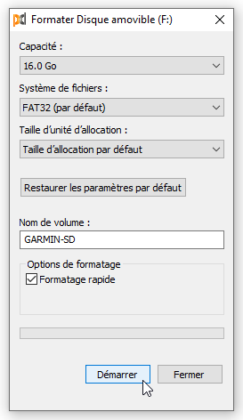
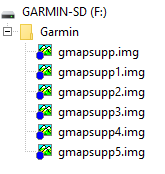

# :material-micro-sd: Installation sur carte SD

Guide pas à pas pour installer une carte Garmin téléchargée depuis ce site sur une carte micro-SD.

---

## Prérequis

!!! info "Carte micro-SD"
    Munissez-vous d'une carte micro-SD vierge ou fraîchement formatée (min. 8 Go — max. 32 Go).

<figure markdown>
  
  <figcaption>Carte micro-SD prête à l'emploi</figcaption>
</figure>

---

## Procédure

### 1. Télécharger la carte

Rendez-vous sur la page [Téléchargements](france.md) et téléchargez la ou les cartes souhaitées.

Les fichiers sont au format `.img`, nommés selon la convention :

```
IGN-BDTOPO-D038-v2026.03.img     ← département (Isère)
IGN-BDTOPO-LA-REUNION-v2026.03.img  ← outre-mer
IGN-BDTOPO-FRANCE-SE-v2026.03.img   ← quadrant France entière
```

### 2. Renommer le fichier

Les appareils Garmin n'acceptent que des fichiers nommés `gmapsupp.img`, `gmapsupp1.img`, `gmapsupp2.img`, etc.

Renommez le fichier téléchargé en `gmapsupp.img` avant de le copier sur la carte SD.

### 3. Créer le dossier Garmin et copier le fichier

Créez un dossier nommé **`Garmin`** à la racine de votre carte micro-SD (s'il n'existe pas déjà), puis copiez-y le fichier renommé.

!!! warning "Emplacement exact"
    Le fichier `gmapsupp.img` doit se trouver dans `Garmin/` **à la racine** de la carte SD, et non dans un sous-dossier.

### 4. Insérer la carte dans l'appareil

Retirez la carte micro-SD de votre lecteur et insérez-la dans votre appareil Garmin.

### 5. Activer la carte

À la suite de ces opérations, vérifiez que la carte est bien active dans votre GPS : **Configuration > Carte > Information carte**.

---

## Installer plusieurs cartes

Il est possible d'installer plusieurs cartes simultanément sur votre appareil Garmin.

Pour cela :

1. Téléchargez la carte supplémentaire.
2. Renommez le fichier `.img` téléchargé en le suffixant : `gmapsupp1.img`, `gmapsupp2.img`, etc., selon le nombre de cartes déjà présentes dans le dossier `Garmin/` de votre carte SD.
3. Copiez ce fichier dans le dossier `Garmin/` de votre carte micro-SD.

<figure markdown>
  
  <figcaption>Exemple de carte SD avec plusieurs fichiers de carte Garmin</figcaption>
</figure>

!!! warning "Nommage obligatoire"
    Les appareils Garmin ne reconnaissent que les fichiers nommés `gmapsupp.img`, `gmapsupp1.img`, `gmapsupp2.img`, etc. Un fichier avec un nom quelconque (ex. `IGN-BDTOPO-D038-v2026.03.img`) ne sera pas détecté.
